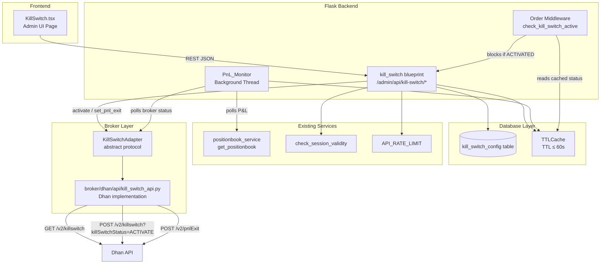

# Design Document: Kill Switch

## Overview

The Kill Switch feature adds automated and manual risk management controls to the OpenAlgo trading platform. The broker (Dhan) owns and manages the deactivation state — our app calls ACTIVATE on the broker's kill switch API when a P&L threshold is breached or when the admin manually triggers it. The broker resets the kill switch automatically before the next market open; no local reset or deactivate logic is needed.

The design is broker-agnostic via an abstract `KillSwitchAdapter` protocol. The Dhan implementation lives at `broker/dhan/api/kill_switch_api.py`. Other brokers implement their own adapter without touching the kill switch engine.

---

## Architecture



Key architectural decisions:

- **Broker owns deactivation**: We only call ACTIVATE. The broker resets automatically — no `/deactivate` or `/reset` endpoints needed.
- **pnlExit offloads threshold monitoring**: When thresholds are saved, we register them with the broker via `pnlExit`. The broker monitors P&L and activates the kill switch itself, independent of our polling cycle.
- **Status cache**: `PnL_Monitor` polls the broker's GET kill switch status API and writes the result to a `TTLCache`. Order middleware and the UI read from this cache — no live broker call on every order.
- **KillSwitchAdapter protocol**: Defines the three broker operations (`get_kill_switch_status`, `activate_kill_switch`, `set_pnl_exit`). Dhan implements it; other brokers implement their own version.
- **Per-broker config**: `KillSwitchConfig` is keyed by `broker_name` for independent state per broker session.

---

## Components and Interfaces

### 1. `database/kill_switch_db.py`

Owns the SQLAlchemy model, session, cache, and all CRUD helpers.

```python
class KillSwitchConfig(Base):
    __tablename__ = "kill_switch_config"
    id: int (PK)
    broker_name: str (unique, indexed)
    enabled: bool (default False)
    profit_threshold: Decimal (default 0)
    loss_threshold: Decimal (default 0)
    kill_switch_status: str  # "ACTIVATED" | "DEACTIVATED" — cached from broker, updated by PnL_Monitor

# Public helpers
def get_kill_switch_config(broker_name: str) -> KillSwitchConfig
def upsert_kill_switch_config(broker_name: str, **fields) -> KillSwitchConfig
def update_kill_switch_status_cache(broker_name: str, status: str) -> None
def is_kill_switch_active(broker_name: str) -> bool  # True when status == "ACTIVATED"
def invalidate_kill_switch_cache(broker_name: str) -> None
```

Cache key: `f"kill_switch:{broker_name}"`, TTL = 60 seconds (using `cachetools.TTLCache`).

### 2. `services/kill_switch_service.py`

Thin service layer that orchestrates business logic. Also defines the abstract `KillSwitchAdapter` protocol.

```python
from typing import Protocol

class KillSwitchAdapter(Protocol):
    def get_kill_switch_status(self, access_token: str) -> str:
        """Returns "ACTIVATED" or "DEACTIVATED"."""
        ...
    def activate_kill_switch(self, access_token: str) -> dict:
        """Calls broker ACTIVATE API. Returns broker response."""
        ...
    def set_pnl_exit(self, access_token: str, profit_threshold: float, loss_threshold: float) -> dict:
        """Registers P&L thresholds with broker. Returns broker response."""
        ...

def get_kill_switch_status(broker_name: str, auth_token: str, broker: str) -> dict
def update_kill_switch_config(broker_name: str, enabled: bool,
                               profit_threshold: float, loss_threshold: float,
                               auth_token: str, broker: str) -> dict
    # Validates thresholds, persists config, calls adapter.set_pnl_exit
def activate_kill_switch(broker_name: str, auth_token: str, broker: str) -> dict
    # Calls adapter.activate_kill_switch, updates local status cache
def get_broker_kill_switch_status(broker_name: str, auth_token: str, broker: str) -> str
    # Calls adapter.get_kill_switch_status, updates local status cache
def evaluate_pnl_thresholds(broker_name: str, current_pnl: float,
                              auth_token: str, broker: str) -> bool
    # Checks enabled flag, profit/loss thresholds (skip if 0),
    # calls activate_kill_switch if breached, logs structured warning
    # Returns True if activation was triggered
```

### 3. `broker/dhan/api/kill_switch_api.py`

Dhan's implementation of the `KillSwitchAdapter` interface.

```python
DHAN_BASE_URL = "https://api.dhan.co/v2"

def get_kill_switch_status(access_token: str) -> str:
    """GET /v2/killswitch — returns "ACTIVATED" or "DEACTIVATED"."""
    ...

def activate_kill_switch(access_token: str) -> dict:
    """POST /v2/killswitch?killSwitchStatus=ACTIVATE"""
    ...

def set_pnl_exit(access_token: str, profit_threshold: float, loss_threshold: float) -> dict:
    """POST /v2/pnlExit with profit/loss threshold body."""
    ...
```

Headers for all calls: `Accept: application/json`, `access-token: <access_token>`.
`activate_kill_switch` and `set_pnl_exit` also include `Content-Type: application/json`.

### 4. `services/pnl_monitor.py`

Background daemon thread. Simplified: polls broker kill switch status and syncs to cache; evaluates P&L thresholds to trigger activation if needed.

```python
class PnLMonitor(threading.Thread):
    POLL_INTERVAL_SECONDS = 55  # ≤ 60s
    MARKET_OPEN  = time(9, 15)  # IST
    MARKET_CLOSE = time(15, 30) # IST

    def run(self) -> None: ...
    def _is_market_hours(self) -> bool: ...
    def _poll_all_active_brokers(self) -> None: ...
        # For each enabled KillSwitchConfig:
        #   1. Call get_broker_kill_switch_status → update cache
        #   2. If status is DEACTIVATED, fetch positions and evaluate_pnl_thresholds
    def _compute_pnl(self, positions: list[dict]) -> float: ...
```

No daily reset logic — the broker resets automatically. The monitor simply re-polls status after market open and the cache reflects the broker's updated state.

### 5. `blueprints/kill_switch.py`

Flask blueprint registered at `/admin`. All routes protected by `@check_session_validity` and `@limiter.limit(API_RATE_LIMIT)`.

```
GET  /admin/api/kill-switch          → get status (broker-reported) + current_pnl + config
POST /admin/api/kill-switch/config   → update enabled/thresholds + call pnlExit
POST /admin/api/kill-switch/activate → call broker ACTIVATE API
```

### 6. Order Middleware

`check_kill_switch_active(broker_name)` reads the cached `kill_switch_status` and returns a 403 JSON error if status is "ACTIVATED".

```python
def check_kill_switch_active(broker_name: str) -> tuple[bool, dict | None]:
    """Returns (is_blocked, error_response). If is_blocked, caller returns error_response."""
    if is_kill_switch_active(broker_name):
        return True, {"status": "error", "message": "Order blocked: Kill Switch is ACTIVATED"}
    return False, None
```

Called in `blueprints/orders.py` before delegating to broker APIs for order-placement routes.

### 7. `frontend/src/pages/admin/KillSwitch.tsx`

React page following the same conventions as `MarketTimings.tsx` and `FreezeQty.tsx`:
- Imports from `@/components/ui/` (Card, Button, Input, Label, Badge)
- Uses `lucide-react` icons (Shield, ShieldOff, AlertTriangle)
- Calls `/admin/api/kill-switch/*` via `adminApi` helper
- Polls broker kill switch status every 30 seconds while page is mounted
- Shows "Activate Kill Switch" button (calls POST /activate); no deactivate or reset buttons

---

## Data Models

### `KillSwitchConfig` (SQLAlchemy)

| Column | Type | Constraints | Default |
|---|---|---|---|
| `id` | Integer | PK, autoincrement | — |
| `broker_name` | String(64) | unique, not null, indexed | — |
| `enabled` | Boolean | not null | `False` |
| `profit_threshold` | Numeric(18,4) | not null, ≥ 0 | `0` |
| `loss_threshold` | Numeric(18,4) | not null, ≥ 0 | `0` |
| `kill_switch_status` | String(16) | not null | `"DEACTIVATED"` |

`kill_switch_status` is a short-lived cache of the broker-reported status. It is updated by `PnL_Monitor` on every poll cycle and should not be treated as authoritative — the broker API is the source of truth.

### API Response Shape (`GET /admin/api/kill-switch`)

```json
{
  "status": "success",
  "data": {
    "broker_name": "dhan",
    "enabled": true,
    "profit_threshold": 5000.0,
    "loss_threshold": 3000.0,
    "kill_switch_status": "DEACTIVATED",
    "current_pnl": 1234.56
  }
}
```

### `POST /admin/api/kill-switch/config` Request Body

```json
{
  "enabled": true,
  "profit_threshold": 5000.0,
  "loss_threshold": 3000.0
}
```

Validation: both thresholds must be numeric and ≥ 0. Returns 400 with descriptive message on failure.

---

## Correctness Properties

*A property is a characteristic or behavior that should hold true across all valid executions of a system — essentially, a formal statement about what the system should do. Properties serve as the bridge between human-readable specifications and machine-verifiable correctness guarantees.*

### Property 1: Default config for new broker

*For any* broker name that has no existing `KillSwitchConfig` record, calling `get_kill_switch_config(broker_name)` should return a record with `enabled=False`, `profit_threshold=0`, `loss_threshold=0`, and `kill_switch_status="DEACTIVATED"`.

**Validates: Requirements 1.2**

---

### Property 2: Config isolation per broker

*For any* two distinct broker names, updating the kill switch config for one broker should leave the other broker's config unchanged.

**Validates: Requirements 1.5, 6.4**

---

### Property 3: Valid threshold values persist

*For any* non-negative `profit_threshold` and `loss_threshold` values submitted via `POST /admin/api/kill-switch/config`, a subsequent `GET /admin/api/kill-switch` should return those exact values.

**Validates: Requirements 2.4, 7.2**

---

### Property 4: Invalid threshold values are rejected

*For any* threshold value that is negative or non-numeric, `POST /admin/api/kill-switch/config` should return HTTP 400 and the stored thresholds should remain unchanged.

**Validates: Requirements 2.5**

---

### Property 5: Manual activation calls broker ACTIVATE API

*For any* active broker session, calling `POST /admin/api/kill-switch/activate` should result in the broker's ACTIVATE API being called exactly once with the correct access token.

**Validates: Requirements 2.7, 7.3**

---

### Property 6: Status cache reflects broker-reported state

*For any* broker kill switch status returned by the broker's GET API ("ACTIVATED" or "DEACTIVATED"), the local `kill_switch_status` cache should be updated to match after a poll cycle.

**Validates: Requirements 4.3**

---

### Property 7: Profit threshold triggers broker activation

*For any* enabled kill switch config where `profit_threshold > 0`, when `evaluate_pnl_thresholds` is called with `current_pnl >= profit_threshold`, the broker's ACTIVATE API should be called. When `profit_threshold = 0`, no P&L value should trigger activation (edge case: zero disables profit-side).

**Validates: Requirements 3.2, 3.4**

---

### Property 8: Loss threshold triggers broker activation

*For any* enabled kill switch config where `loss_threshold > 0`, when `evaluate_pnl_thresholds` is called with `current_pnl <= -loss_threshold`, the broker's ACTIVATE API should be called. When `loss_threshold = 0`, no P&L value should trigger activation (edge case: zero disables loss-side).

**Validates: Requirements 3.3, 3.5**

---

### Property 9: P&L computation from position book

*For any* list of position records returned by the broker, `_compute_pnl(positions)` should return the sum of all `pnl` fields across all positions.

**Validates: Requirements 4.1**

---

### Property 10: Broker status polling updates cache

*For any* broker with an enabled kill switch config, after `_poll_all_active_brokers()` runs, the local `kill_switch_status` cache should reflect the value returned by the broker's GET kill switch status API.

**Validates: Requirements 4.3, 4.5**

---

### Property 11: Order blocking when kill switch is ACTIVATED

*For any* order placement request when the cached broker kill switch status is "ACTIVATED", the middleware should return an error response and the order should not be forwarded to the broker API.

**Validates: Requirements 5.1**

---

### Property 12: Read-only operations permitted when ACTIVATED

*For any* read-only operation (position queries, order book queries, fund queries) when the kill switch status is "ACTIVATED", the operation should proceed normally and return a success response.

**Validates: Requirements 5.4**

---

### Property 13: GET endpoint returns all required fields

*For any* authenticated session with an active broker, `GET /admin/api/kill-switch` should return a response containing all of: `broker_name`, `enabled`, `profit_threshold`, `loss_threshold`, `kill_switch_status`, and `current_pnl`.

**Validates: Requirements 7.1**

---

### Property 14: Unauthenticated requests return 401

*For any* kill switch API endpoint, a request without a valid session should return HTTP 401.

**Validates: Requirements 7.4**

---

## Error Handling

| Scenario | Handling |
|---|---|
| Broker kill switch GET API returns error during status poll | Log error at WARNING level; retain last cached status; do not trigger activation |
| Broker ACTIVATE API returns error | Log error at ERROR level; return 500 to caller; do not update local cache |
| Broker pnlExit API returns error when saving thresholds | Log error at WARNING level; return 500 to caller; local config is still saved |
| Position book API returns error during P&L poll | Log error at WARNING level; retain last known P&L; do not trigger activation |
| Broker not in session when order middleware runs | Pass through (no kill switch check without a broker context) |
| Invalid threshold submitted via API | Return 400 with message `"profit_threshold and loss_threshold must be non-negative numbers"` |
| Order blocked by kill switch | Return 403 with `{"status": "error", "message": "Order blocked: Kill Switch is ACTIVATED"}` |
| PnL_Monitor thread crashes | Log exception; thread restarts via supervisor or app restart (no auto-restart in v1) |
| Session has no auth_token when monitor tries to poll | Skip that broker for this cycle; log at DEBUG level |

---

## Testing Strategy

### Unit Tests

Focus on specific examples, edge cases, and error conditions:

- `test_kill_switch_db.py`: CRUD helpers, default record creation, cache invalidation, status cache update
- `test_kill_switch_service.py`: threshold evaluation logic, activate call forwarding, pnlExit call on config save
- `test_pnl_monitor.py`: `_compute_pnl` with various position shapes, market hours check, status polling and cache update
- `test_kill_switch_blueprint.py`: API endpoint responses, auth enforcement, validation errors
- `test_dhan_kill_switch_api.py`: Dhan adapter HTTP calls, response parsing
- Edge cases: `profit_threshold=0` does not trigger, `loss_threshold=0` does not trigger, P&L exactly at threshold boundary

### Property-Based Tests

Using **Hypothesis** (Python property-based testing library). Each test runs a minimum of 100 iterations.

```python
# Feature: kill-switch, Property 1: Default config for new broker
@given(broker_name=st.text(min_size=1, max_size=64))
@settings(max_examples=100)
def test_default_config_for_new_broker(broker_name): ...

# Feature: kill-switch, Property 2: Config isolation per broker
@given(broker_a=st.text(min_size=1), broker_b=st.text(min_size=1),
       threshold=st.floats(min_value=0, max_value=1e6))
@settings(max_examples=100)
def test_config_isolation_per_broker(broker_a, broker_b, threshold): ...

# Feature: kill-switch, Property 3: Valid threshold values persist
@given(profit=st.floats(min_value=0, max_value=1e7),
       loss=st.floats(min_value=0, max_value=1e7))
@settings(max_examples=100)
def test_valid_thresholds_persist(profit, loss): ...

# Feature: kill-switch, Property 4: Invalid threshold values are rejected
@given(threshold=st.one_of(st.floats(max_value=-0.01), st.text()))
@settings(max_examples=100)
def test_invalid_thresholds_rejected(threshold): ...

# Feature: kill-switch, Property 7: Profit threshold triggers broker activation
@given(threshold=st.floats(min_value=0.01, max_value=1e6),
       pnl=st.floats(min_value=0.01, max_value=2e6))
@settings(max_examples=100)
def test_profit_threshold_activation(threshold, pnl):
    # assume pnl >= threshold; assert broker ACTIVATE API was called
    ...

# Feature: kill-switch, Property 8: Loss threshold triggers broker activation
@given(threshold=st.floats(min_value=0.01, max_value=1e6),
       pnl=st.floats(min_value=-2e6, max_value=-0.01))
@settings(max_examples=100)
def test_loss_threshold_activation(threshold, pnl):
    # assume pnl <= -threshold; assert broker ACTIVATE API was called
    ...

# Feature: kill-switch, Property 9: P&L computation
@given(positions=st.lists(st.fixed_dictionaries({"pnl": st.floats(-1e6, 1e6)})))
@settings(max_examples=100)
def test_pnl_computation(positions): ...

# Feature: kill-switch, Property 11: Order blocking when ACTIVATED
@given(order_data=st.fixed_dictionaries({
    "symbol": st.text(min_size=1),
    "action": st.sampled_from(["BUY", "SELL"]),
    "quantity": st.integers(min_value=1)
}))
@settings(max_examples=100)
def test_order_blocked_when_activated(order_data): ...
```

Each property-based test must be tagged with a comment in the format:
`# Feature: kill-switch, Property N: <property_text>`

Unit tests cover the remaining properties (5, 6, 10, 12, 13, 14) as specific examples since they involve HTTP client interactions or scheduled behavior that is better validated with concrete fixtures.
