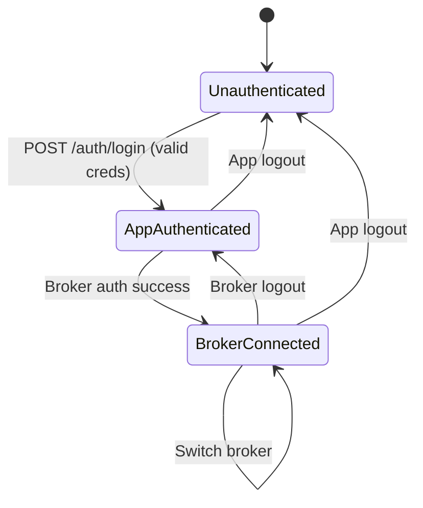

# Design Document: Multi-Broker Login

## Overview

This design separates OpenAlgo's authentication into two independent layers:

1. **App Authentication** – validates the user against the local user database (username/password). Establishes a `User_Session` that is independent of any broker connection.
2. **Broker Session Management** – after app login, allows the user to select a broker, enter/save credentials inline, and authenticate. Only one broker session is active at a time.

The key architectural change is decoupling `session["logged_in"]` (broker connected) from `session["user"]` (app authenticated). Today these are tightly coupled in `handle_auth_success`. The new design treats them as orthogonal states, allowing dashboard access (with degraded UI) even without a broker session.

### Design Goals

- Zero changes to existing `Broker_Module` interfaces (`/broker/<name>/api/`)
- Per-user, per-broker credential storage in DB (replaces single `.env` credential set)
- Existing trading features continue to work unchanged when a broker is active
- Frontend renders correct UI based on a two-level session status response

---

## Architecture

```mermaid
flowchart TD
    subgraph Frontend [React SPA]
        LP[Login Page]
        BS[Broker Selection + Credential Entry]
        DB[Dashboard]
    end

    subgraph Backend [Flask Backend]
        AUTH[auth_bp /auth/*]
        BRSM[broker_session_bp /broker-session/*]
        BCS[broker_credential_store_bp /api/broker-credentials/*]
        BRLOGIN[brlogin_bp /<broker>/callback]
    end

    subgraph Data [Database Layer]
        USER_DB[(user_db - Users)]
        CRED_DB[(broker_credentials_db - Per-user creds)]
        AUTH_DB[(auth_db - Active tokens)]
    end

    LP -->|POST /auth/login| AUTH
    AUTH -->|session["user"] set| BS
    BS -->|Save creds| BCS
    BCS -->|Persist| CRED_DB
    BS -->|Initiate broker auth| BRSM
    BRSM -->|Load creds from DB| CRED_DB
    BRSM -->|Trigger broker auth| BRLOGIN
    BRLOGIN -->|auth_token| AUTH_DB
    BRLOGIN -->|Success| DB
    DB -->|Trading calls| AUTH_DB
```

### Session State Machine



---

## Components and Interfaces

### 1. Auth Blueprint (modified: `blueprints/auth.py`)

**Changes:**
- `POST /auth/login` – on success, sets `session["user"]` only. Does NOT set `session["logged_in"]`. Returns `{"redirect": "/broker-select"}`.
- `GET /auth/session-status` – returns two-level status:
  ```json
  {
    "authenticated": true,
    "logged_in": false,
    "user": "alice",
    "broker": null,
    "available_brokers": ["dhan", "angel", "zerodha"]
  }
  ```
- `POST /auth/logout` – clears entire session (app + broker). Revokes broker token if active.

### 2. Broker Session Blueprint (new: `blueprints/broker_session.py`)

| Endpoint | Method | Description |
|----------|--------|-------------|
| `/broker-session/connect` | POST | Initiates broker auth using stored credentials |
| `/broker-session/disconnect` | POST | Broker logout only; preserves User_Session |
| `/broker-session/status` | GET | Returns active broker info or null |

**Connect flow:**
1. Validates `session["user"]` exists
2. If an active broker session exists, revokes it first (single-active constraint)
3. Loads credentials from `broker_credentials_db` for (user, broker)
4. Sets environment-equivalent variables in memory for the broker module
5. Delegates to existing `broker_auth_functions` registry
6. On success calls `handle_auth_success` (which sets `session["logged_in"]`, stores token in `auth_db`)

**Disconnect flow:**
1. Revokes token via `upsert_auth(username, "", "", revoke=True)`
2. Clears `session["logged_in"]`, `session["broker"]`, `session["AUTH_TOKEN"]`
3. Preserves `session["user"]`
4. Returns `{"redirect": "/broker-select"}`

### 3. Broker Credential Store Blueprint (new: `blueprints/broker_credentials_store.py`)

| Endpoint | Method | Description |
|----------|--------|-------------|
| `/api/broker-credentials/list` | GET | All saved brokers for current user (masked secrets) |
| `/api/broker-credentials/<broker>` | GET | Credentials for specific broker (masked) |
| `/api/broker-credentials/<broker>` | POST | Save/update credentials for a broker |
| `/api/broker-credentials/<broker>` | DELETE | Remove saved credentials for a broker |

**Credential fields per broker:**
- `api_key` (stored plaintext — non-sensitive identifier)
- `api_secret` (encrypted with Fernet, same key derivation as `auth_db.py`)
- `client_id` (stored plaintext)
- `redirect_url` (stored plaintext)
- `additional_config` (JSON text — broker-specific extras like market API keys)

### 4. Frontend: Broker Selection Page (modified: `frontend/src/pages/BrokerSelect.tsx`)

**Changes:**
- Shows all supported brokers (not just the one from `.env`)
- On broker select, shows inline credential form (API key, secret, client ID, redirect URL)
- Pre-populates from saved credentials API
- On submit: saves credentials → triggers connect → redirect to dashboard
- Masks sensitive fields in display

### 5. Frontend: Auth Store (modified: `frontend/src/stores/authStore.ts`)

**Changes:**
- Add `isBrokerConnected` boolean separate from `isAuthenticated`
- `isAuthenticated` = app-level auth (`session["user"]` exists)
- `isBrokerConnected` = broker session active (`session["logged_in"]` is true)
- Dashboard renders warning banner when `isAuthenticated && !isBrokerConnected`

### 6. Dashboard (modified: `frontend/src/pages/Dashboard.tsx`)

- When no broker is connected: shows empty data panels + prominent warning banner with link to broker selection
- All data-fetching hooks skip API calls when `!isBrokerConnected`

---

## Data Models

### BrokerCredential Table (new: `database/broker_credentials_db.py`)

```python
class BrokerCredential(Base):
    __tablename__ = "broker_credentials"
    
    id = Column(Integer, primary_key=True)
    username = Column(String(255), nullable=False)        # FK to user
    broker_name = Column(String(50), nullable=False)      # e.g. "dhan", "angel"
    api_key = Column(Text, nullable=True)                 # plaintext identifier
    api_secret_encrypted = Column(Text, nullable=True)    # Fernet-encrypted
    client_id = Column(String(255), nullable=True)        # plaintext
    redirect_url = Column(Text, nullable=True)            # plaintext
    additional_config = Column(Text, nullable=True)       # JSON for broker-specific fields
    created_at = Column(DateTime(timezone=True), default=func.now())
    updated_at = Column(DateTime(timezone=True), default=func.now(), onupdate=func.now())

    __table_args__ = (
        UniqueConstraint("username", "broker_name", name="uq_user_broker"),
        Index("idx_broker_cred_username", "username"),
    )
```

### Session State (Flask session keys)

| Key | Set When | Cleared When |
|-----|----------|--------------|
| `session["user"]` | App login success | App logout |
| `session["logged_in"]` | Broker auth success | Broker logout OR app logout |
| `session["broker"]` | Broker auth success | Broker logout OR app logout |
| `session["AUTH_TOKEN"]` | Broker auth success | Broker logout OR app logout |
| `session["FEED_TOKEN"]` | Broker auth success (if supported) | Broker logout OR app logout |
| `session["login_time"]` | Broker auth success | Broker logout OR app logout |

### Existing Auth Table (unchanged)

The `auth` table in `auth_db.py` continues to store the active broker token. On broker switch, the old row is revoked and a new row is upserted.

---


## Correctness Properties

*A property is a characteristic or behavior that should hold true across all valid executions of a system — essentially, a formal statement about what the system should do. Properties serve as the bridge between human-readable specifications and machine-verifiable correctness guarantees.*

### Property 1: App login establishes user session without broker session

*For any* valid username/password pair, after successful login, `session["user"]` SHALL be set to the username AND `session["logged_in"]` SHALL be False (or unset).

**Validates: Requirements 1.1**

### Property 2: Invalid login preserves existing session state

*For any* invalid credential pair (wrong username or wrong password), submitting login SHALL return an error response AND SHALL NOT modify any pre-existing session keys.

**Validates: Requirements 1.5**

### Property 3: Broker disconnect preserves app session

*For any* session where both `session["user"]` and `session["logged_in"]` are set, calling broker disconnect SHALL clear `session["logged_in"]` and `session["broker"]` while preserving `session["user"]`.

**Validates: Requirements 1.3, 4.2, 4.4**

### Property 4: App logout clears both app and broker session

*For any* session with an active user (and optionally an active broker), calling app logout SHALL clear all session keys including `session["user"]`, `session["logged_in"]`, and `session["broker"]`, AND revoke any active broker token in the database.

**Validates: Requirements 1.4**

### Property 5: Successful broker auth establishes active broker session

*For any* valid broker and valid credentials, after broker authentication succeeds, `session["logged_in"]` SHALL be True AND `session["broker"]` SHALL equal the selected broker name AND the auth token SHALL be stored in the `auth` table.

**Validates: Requirements 2.2, 2.4**

### Property 6: Failed broker auth preserves pre-auth state

*For any* broker authentication attempt that fails (invalid token, bad credentials), the response SHALL contain an error message AND `session["logged_in"]` SHALL remain False AND `session["user"]` SHALL be unchanged.

**Validates: Requirements 2.5**

### Property 7: Single active broker invariant

*For any* user session, at most one broker SHALL be active at any time. After any sequence of connect/disconnect operations, querying the session SHALL return at most one broker name.

**Validates: Requirements 3.1**

### Property 8: Broker switch revokes old and activates new

*For any* user with active broker A, when connecting to broker B, the auth token for broker A SHALL be revoked in the database AND `session["broker"]` SHALL equal B AND the auth token for B SHALL be stored unrevoked.

**Validates: Requirements 3.2, 3.3, 3.4**

### Property 9: Broker disconnect revokes token

*For any* user with an active broker session, calling broker disconnect SHALL set `is_revoked=True` for that user's auth record in the database.

**Validates: Requirements 4.1**

### Property 10: Credential save/retrieve round trip

*For any* user, broker name, and credential set (api_key, api_secret, client_id, redirect_url), saving credentials and then retrieving them SHALL return the same values (with api_secret decrypted server-side to match the original).

**Validates: Requirements 5.2, 5.5**

### Property 11: Multiple brokers per user storage

*For any* user and any set of N distinct broker names (N ≥ 1), saving credentials for each broker SHALL result in N distinct records in the database, all retrievable independently.

**Validates: Requirements 5.3**

### Property 12: API secret encryption round trip

*For any* non-empty api_secret string, encrypting it with Fernet and then decrypting SHALL produce the original string, AND the encrypted value SHALL NOT equal the plaintext.

**Validates: Requirements 5.6**

### Property 13: Sensitive fields masked in API response

*For any* stored credential with a non-empty api_secret, the GET response SHALL return a masked version where the full plaintext is NOT exposed (only first N characters shown, rest replaced with asterisks).

**Validates: Requirements 5.7**

### Property 14: Invalid credentials rejected without auth trigger

*For any* credential submission where required fields (api_key or api_secret) are empty or whitespace-only, the API SHALL return a validation error AND SHALL NOT initiate broker authentication.

**Validates: Requirements 5.8**

### Property 15: Active broker provides context to trading calls

*For any* trading service call made while an Active_Broker_Session exists, the broker name and auth token provided to the service SHALL match the currently active broker in the session.

**Validates: Requirements 6.1, 6.2**

### Property 16: Trading without broker returns error

*For any* trading endpoint called when `session["logged_in"]` is False (no active broker), the response SHALL be an error with a message indicating broker login is required.

**Validates: Requirements 6.4**

### Property 17: Session status accurately reflects auth state

*For any* combination of (user authenticated, broker connected), the `/auth/session-status` response SHALL correctly report: `authenticated` matching whether `session["user"]` is set, `logged_in` matching whether `session["logged_in"]` is True, `broker` matching `session["broker"]` or null, and `available_brokers` populated when authenticated.

**Validates: Requirements 7.1, 7.2, 7.3, 7.4**

---

## Error Handling

### App Authentication Errors

| Error | Response | HTTP Status |
|-------|----------|-------------|
| Invalid username/password | `{"status": "error", "message": "Invalid credentials"}` | 401 |
| Rate limit exceeded | `{"error": "Rate limit exceeded"}` | 429 |
| Missing required fields | `{"status": "error", "message": "Username and password required"}` | 400 |

### Broker Session Errors

| Error | Response | HTTP Status |
|-------|----------|-------------|
| No app session (user not logged in) | `{"status": "error", "message": "Not authenticated"}` | 401 |
| No stored credentials for broker | `{"status": "error", "message": "No credentials found for broker X"}` | 404 |
| Broker auth failure | `{"status": "error", "message": "<broker-specific error>"}` | 401 |
| Broker module not found | `{"status": "error", "message": "Broker not supported"}` | 404 |
| Trading call without active broker | `{"status": "error", "message": "Broker login required"}` | 401 |

### Credential Store Errors

| Error | Response | HTTP Status |
|-------|----------|-------------|
| Empty/invalid credentials | `{"status": "error", "message": "API key is required"}` | 400 |
| Encryption failure | `{"status": "error", "message": "Failed to store credentials"}` | 500 |
| DB write failure | `{"status": "error", "message": "Database error"}` | 500 |

### Frontend Error Handling

- Session expiry during broker operation → redirect to login with "Session expired" toast
- Broker disconnect during trading → show warning banner, disable trading controls
- Network errors on credential save → show inline error, preserve form state

---

## Testing Strategy

### Unit Tests

Focus on specific examples, edge cases, and integration points:

- Login with valid credentials returns 200 and sets `session["user"]`
- Login with wrong password returns 401
- Broker disconnect while no broker is active returns appropriate response
- Credential save with special characters in api_secret encrypts/decrypts correctly
- Masking function with secrets shorter than show_chars handles edge case
- Session status with all three states (unauth, app-only, full) returns correct JSON
- Broker switch from dhan to angel revokes dhan token specifically

### Property-Based Tests

Library: **Hypothesis** (Python) for backend, **fast-check** (TypeScript) for frontend logic.

Each test runs minimum 100 iterations.

| Property | Test Description | Tag |
|----------|-----------------|-----|
| P1 | Generate random valid users, login, assert session state | Feature: multi-broker-login, Property 1: App login establishes user session without broker session |
| P2 | Generate random invalid creds, attempt login, assert no session change | Feature: multi-broker-login, Property 2: Invalid login preserves existing session state |
| P3 | Generate random user+broker sessions, disconnect broker, assert user preserved | Feature: multi-broker-login, Property 3: Broker disconnect preserves app session |
| P4 | Generate random full sessions, logout, assert all cleared | Feature: multi-broker-login, Property 4: App logout clears both app and broker session |
| P5 | Generate random broker names with mock auth success, assert session established | Feature: multi-broker-login, Property 5: Successful broker auth establishes active broker session |
| P6 | Generate random broker auth failures, assert session unchanged | Feature: multi-broker-login, Property 6: Failed broker auth preserves pre-auth state |
| P7 | Generate random sequences of connect operations, assert at most one active | Feature: multi-broker-login, Property 7: Single active broker invariant |
| P8 | Generate pairs of brokers, connect first then second, assert old revoked new active | Feature: multi-broker-login, Property 8: Broker switch revokes old and activates new |
| P9 | Generate random active sessions, disconnect, assert token revoked in DB | Feature: multi-broker-login, Property 9: Broker disconnect revokes token |
| P10 | Generate random credential tuples, save then retrieve, assert equality | Feature: multi-broker-login, Property 10: Credential save/retrieve round trip |
| P11 | Generate random user with N brokers, save all, assert N records exist | Feature: multi-broker-login, Property 11: Multiple brokers per user storage |
| P12 | Generate random strings, encrypt then decrypt, assert round trip | Feature: multi-broker-login, Property 12: API secret encryption round trip |
| P13 | Generate random secrets, store, retrieve via API, assert masked | Feature: multi-broker-login, Property 13: Sensitive fields masked in API response |
| P14 | Generate whitespace/empty strings as credentials, submit, assert rejected | Feature: multi-broker-login, Property 14: Invalid credentials rejected without auth trigger |
| P15 | Generate random active sessions, call trading endpoint, assert correct broker used | Feature: multi-broker-login, Property 15: Active broker provides context to trading calls |
| P16 | Generate sessions without broker, call trading endpoints, assert error | Feature: multi-broker-login, Property 16: Trading without broker returns error |
| P17 | Generate all 3 session states, call session-status, assert correct response shape | Feature: multi-broker-login, Property 17: Session status accurately reflects auth state |

### Integration Tests

- Full flow: login → save credentials → connect broker → verify dashboard loads → disconnect → verify warning banner → reconnect
- Broker switch: connect dhan → connect angel → verify dhan revoked, angel active
- Session expiry: connect broker → simulate time past expiry → verify both sessions cleared
