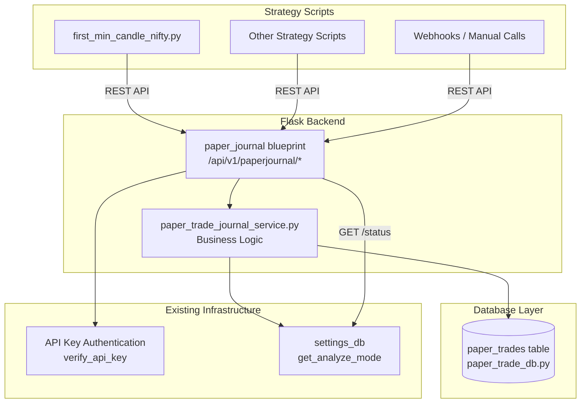

# Design Document: Paper Trade Journal

## Overview

The Paper Trade Journal is a standalone service that provides structured trade lifecycle logging for paper testing in Analyzer mode. It is completely separate from the existing `analyzer_logs` table (which captures raw API requests/responses). The journal provides higher-level trade records with entry/exit lifecycle tracking, automatic P&L calculation, and queryable summaries with per-strategy filtering.

The service is broker-agnostic and script-agnostic — any strategy script, webhook, or API caller can log trades using only the standard API key for authentication.

---

## Architecture



Key architectural decisions:

- **Separate database table**: `paper_trades` table in its own module (`database/paper_trade_db.py`) with a dedicated SQLAlchemy session following the same pattern as `kill_switch_db.py`.
- **All columns nullable except strategy_name**: Every trade data column is nullable so callers can log only what they have available. Only `id` (PK), `created_at` (auto-timestamp), and `strategy_name` are non-nullable.
- **REST-only interface**: Since strategy scripts run as subprocesses and cannot import app modules, all interactions happen via REST API at `/api/v1/paperjournal/`.
- **P&L auto-calculation**: When both entry and exit option prices plus quantity are available, P&L is calculated server-side on update (PATCH).
- **Metadata merge semantics**: When custom_metadata is provided on PATCH, it merges (shallow) with existing metadata rather than replacing it.
- **API key authentication**: Uses the same `verify_api_key` mechanism as other API endpoints — no broker-specific auth required.

---

## Components and Interfaces

### 1. `database/paper_trade_db.py`

Owns the SQLAlchemy model, session, and all CRUD helpers.

```python
class PaperTrade(Base):
    __tablename__ = "paper_trades"
    id: int (PK, autoincrement)
    created_at: DateTime (non-nullable, default=func.now())
    trade_date: Date (nullable)
    strategy_name: String(128) (non-nullable)
    direction: String(16) (nullable)  # BULLISH | BEARISH | NEUTRAL
    entry_time: DateTime (nullable)
    entry_spot_price: Numeric(18,4) (nullable)
    entry_option_symbol: String(64) (nullable)
    entry_option_price: Numeric(18,4) (nullable)
    entry_quantity: Integer (nullable)
    entry_action: String(8) (nullable)  # BUY | SELL
    exit_time: DateTime (nullable)
    exit_spot_price: Numeric(18,4) (nullable)
    exit_option_price: Numeric(18,4) (nullable)
    exit_reason: String(32) (nullable)  # SL | TARGET | TIME | MANUAL
    pnl: Numeric(18,4) (nullable)
    custom_metadata: Text (nullable)  # JSON-serialized

# Public helpers
def init_db() -> None
def create_trade(**fields) -> PaperTrade
def get_trade(trade_id: int) -> PaperTrade | None
def update_trade(trade_id: int, **fields) -> PaperTrade | None
def query_trades(start_date=None, end_date=None, strategy_name=None) -> list[PaperTrade]
def get_trade_summary(start_date=None, end_date=None, strategy_name=None) -> dict
```

Indexes:
- `idx_paper_trades_date` on `trade_date` (date-based queries)
- `idx_paper_trades_strategy` on `strategy_name` (strategy filtering)
- `idx_paper_trades_date_strategy` composite on `(trade_date, strategy_name)`

### 2. `services/paper_trade_journal_service.py`

Service layer handling business logic: P&L calculation, metadata merge, summary aggregation.

```python
def open_trade(trade_data: dict) -> dict
    # Validates direction/action enum values (if provided)
    # Serializes custom_metadata to JSON
    # Calls create_trade, returns {"status": "success", "trade_id": id}

def close_trade(trade_id: int, update_data: dict) -> dict
    # Fetches existing trade (404 if not found)
    # Merges custom_metadata (shallow merge)
    # Calculates P&L if entry_option_price, exit_option_price, and entry_quantity are all present:
    #   BUY: pnl = (exit_option_price - entry_option_price) * entry_quantity
    #   SELL: pnl = (entry_option_price - exit_option_price) * entry_quantity
    # Calls update_trade, returns updated record

def list_trades(start_date=None, end_date=None, strategy_name=None) -> list[dict]
    # Delegates to query_trades, serializes results

def get_summary(start_date=None, end_date=None, strategy_name=None) -> dict
    # Returns: total_trades, total_pnl, winning_trades, losing_trades, win_rate, per_strategy breakdown

def get_journal_status() -> dict
    # Calls get_analyze_mode() and returns {"mode": "analyze"|"live", "journal_active": bool}
```

### 3. `blueprints/paper_journal.py`

Flask blueprint registered at `/api/v1/paperjournal`. All routes authenticated via API key.

```
POST   /api/v1/paperjournal/trade          → open a new trade
PATCH  /api/v1/paperjournal/trade/<id>     → update/close a trade
GET    /api/v1/paperjournal/trades         → list trades (with filters)
GET    /api/v1/paperjournal/summary        → get summary stats
GET    /api/v1/paperjournal/status         → get journal/mode status
```

Authentication: Each endpoint extracts `apikey` from request JSON body (POST/PATCH) or query parameter (GET), validates via `verify_api_key()`.

### 4. Integration in `first_min_candle_nifty.py`

The strategy script adds a paper journal helper class that wraps REST calls:

```python
class PaperJournalClient:
    def __init__(self, api_key: str, host: str):
        self.api_key = api_key
        self.host = host
        self._active = None  # Lazy-loaded mode detection

    def is_active(self) -> bool:
        """Query /api/v1/paperjournal/status to check if analyzer mode is on."""
        ...

    def open_trade(self, **kwargs) -> int | None:
        """POST /api/v1/paperjournal/trade. Returns trade_id or None."""
        ...

    def close_trade(self, trade_id: int, **kwargs) -> bool:
        """PATCH /api/v1/paperjournal/trade/<id>. Returns success bool."""
        ...
```

The script initializes the client and calls `open_trade` after entry and `close_trade` after exit, only when `is_active()` returns True.

---

## Data Models

### `PaperTrade` (SQLAlchemy)

| Column | Type | Constraints | Default |
|---|---|---|---|
| `id` | Integer | PK, autoincrement | — |
| `created_at` | DateTime(timezone=True) | not null | `func.now()` |
| `trade_date` | Date | nullable | — |
| `strategy_name` | String(128) | not null | — |
| `direction` | String(16) | nullable | — |
| `entry_time` | DateTime(timezone=True) | nullable | — |
| `entry_spot_price` | Numeric(18,4) | nullable | — |
| `entry_option_symbol` | String(64) | nullable | — |
| `entry_option_price` | Numeric(18,4) | nullable | — |
| `entry_quantity` | Integer | nullable | — |
| `entry_action` | String(8) | nullable | — |
| `exit_time` | DateTime(timezone=True) | nullable | — |
| `exit_spot_price` | Numeric(18,4) | nullable | — |
| `exit_option_price` | Numeric(18,4) | nullable | — |
| `exit_reason` | String(32) | nullable | — |
| `pnl` | Numeric(18,4) | nullable | — |
| `custom_metadata` | Text | nullable | — |

### API Request/Response Shapes

**POST `/api/v1/paperjournal/trade`**

Request:
```json
{
  "apikey": "your-api-key",
  "strategy_name": "FirstMinCandle-NIFTY",
  "direction": "BULLISH",
  "trade_date": "2025-01-15",
  "entry_time": "2025-01-15T09:16:05+05:30",
  "entry_spot_price": 24150.50,
  "entry_option_symbol": "NIFTY15JAN25C24200",
  "entry_option_price": 185.00,
  "entry_quantity": 75,
  "entry_action": "BUY",
  "custom_metadata": {"first_candle_high": 24180, "first_candle_low": 24100, "bias": "BULLISH"}
}
```

Response (201):
```json
{
  "status": "success",
  "data": {"trade_id": 42}
}
```

**PATCH `/api/v1/paperjournal/trade/42`**

Request:
```json
{
  "apikey": "your-api-key",
  "exit_time": "2025-01-15T10:45:00+05:30",
  "exit_spot_price": 24050.25,
  "exit_option_price": 145.00,
  "exit_reason": "SL",
  "custom_metadata": {"sl_trigger_spot": 24050.25}
}
```

Response (200):
```json
{
  "status": "success",
  "data": {
    "trade_id": 42,
    "strategy_name": "FirstMinCandle-NIFTY",
    "direction": "BULLISH",
    "entry_option_price": 185.00,
    "exit_option_price": 145.00,
    "entry_quantity": 75,
    "pnl": -3000.00,
    "exit_reason": "SL",
    "custom_metadata": {"first_candle_high": 24180, "first_candle_low": 24100, "bias": "BULLISH", "sl_trigger_spot": 24050.25}
  }
}
```

**GET `/api/v1/paperjournal/summary?apikey=xxx&start_date=2025-01-15&end_date=2025-01-15`**

Response (200):
```json
{
  "status": "success",
  "data": {
    "total_trades": 5,
    "total_pnl": 2500.00,
    "winning_trades": 3,
    "losing_trades": 2,
    "win_rate": 60.0,
    "per_strategy": {
      "FirstMinCandle-NIFTY": {"total_trades": 3, "total_pnl": 1800.00, "winning_trades": 2, "losing_trades": 1, "win_rate": 66.67},
      "OtherStrategy": {"total_trades": 2, "total_pnl": 700.00, "winning_trades": 1, "losing_trades": 1, "win_rate": 50.0}
    }
  }
}
```

---

## Correctness Properties

### Property 1: Nullable columns accept any subset of fields

*For any* subset of trade data columns (excluding `id` and `created_at`), creating a Trade_Record with only that subset of fields populated and the rest as NULL should succeed without errors.

**Validates: Requirements 1.3**

---

### Property 2: Custom metadata JSON round-trip

*For any* valid JSON-serializable Python dictionary stored as custom_metadata, reading the Trade_Record back and deserializing the custom_metadata should produce a dictionary equal to the original.

**Validates: Requirements 1.6, 2.3**

---

### Property 3: Trade creation returns unique IDs

*For any* sequence of trade creation calls with arbitrary field combinations, each returned trade_id should be unique and positive.

**Validates: Requirements 2.1, 2.4**

---

### Property 4: P&L calculation correctness for BUY trades

*For any* entry_option_price, exit_option_price, and entry_quantity where entry_action is "BUY", the calculated pnl should equal `(exit_option_price - entry_option_price) × entry_quantity`.

**Validates: Requirements 3.3**

---

### Property 5: P&L calculation correctness for SELL trades

*For any* entry_option_price, exit_option_price, and entry_quantity where entry_action is "SELL", the calculated pnl should equal `(entry_option_price - exit_option_price) × entry_quantity`.

**Validates: Requirements 3.3**

---

### Property 6: P&L remains NULL when data is incomplete

*For any* Trade_Record where entry_option_price, exit_option_price, or entry_quantity is NULL, the pnl field should remain NULL after an update (not calculated).

**Validates: Requirements 3.3**

---

### Property 7: Custom metadata shallow merge on update

*For any* two JSON dictionaries (existing metadata and update metadata), after a PATCH the resulting custom_metadata should contain all keys from both dictionaries, with the update values taking precedence for overlapping keys.

**Validates: Requirements 3.4**

---

### Property 8: Date range filter returns correct subset

*For any* set of Trade_Records with various trade_dates, querying with a start_date and end_date should return exactly those trades whose trade_date is within the range [start_date, end_date] (inclusive on both ends).

**Validates: Requirements 4.2, 4.3**

---

### Property 9: Strategy filter returns exact matches only

*For any* set of Trade_Records with various strategy_names, filtering by a specific strategy_name should return only trades with that exact strategy_name.

**Validates: Requirements 4.5**

---

### Property 10: Summary statistics consistency

*For any* set of Trade_Records with non-null pnl values, the summary should satisfy: `winning_trades + losing_trades <= total_trades`, `total_pnl == sum of all pnl values`, and `win_rate == (winning_trades / trades_with_pnl) × 100`.

**Validates: Requirements 5.2**

---

### Property 11: Strategy name accepts any string

*For any* non-empty string value used as strategy_name, creating a Trade_Record should succeed without validation errors.

**Validates: Requirements 6.3**

---

### Property 12: Query results ordered by entry_time descending

*For any* set of Trade_Records returned by the query endpoint, the entry_time values should be in non-increasing order (most recent first), with NULL entry_times sorted consistently.

**Validates: Requirements 4.7**

---

## Error Handling

| Scenario | Handling |
|---|---|
| Invalid or missing API key on any endpoint | Return HTTP 401 with `{"status": "error", "message": "Invalid API key"}` |
| PATCH with non-existent trade_id | Return HTTP 404 with `{"status": "error", "message": "Trade not found"}` |
| Invalid date format in query parameters | Return HTTP 400 with `{"status": "error", "message": "Invalid date format. Use YYYY-MM-DD"}` |
| JSON deserialization error on custom_metadata read | Log warning; return raw string as metadata |
| Database connection failure | Return HTTP 500 with `{"status": "error", "message": "Internal server error"}`; log exception |
| Invalid direction value (not BULLISH/BEARISH/NEUTRAL) | Accept and store as-is (no strict validation — broker-agnostic design) |
| Invalid exit_reason value | Accept and store as-is (flexible for custom exit reasons) |

---

## Testing Strategy

### Unit Tests

- `test_paper_trade_db.py`: CRUD operations, nullable column handling, index existence, JSON metadata storage/retrieval
- `test_paper_trade_journal_service.py`: P&L calculation logic, metadata merge, summary aggregation, mode detection
- `test_paper_journal_blueprint.py`: API endpoint responses, authentication, error responses, filter parameter parsing
- Edge cases: all-null trade record, metadata merge with empty existing metadata, P&L with zero quantity, summary with no trades

### Property-Based Tests

Using **Hypothesis** (Python property-based testing library). Each test runs a minimum of 100 iterations.

```python
# Feature: paper-trade-journal, Property 1: Nullable columns accept any subset of fields
@given(fields=st.fixed_dictionaries({}, optional={
    "trade_date": st.dates(),
    "strategy_name": st.text(min_size=1, max_size=128),
    "direction": st.sampled_from(["BULLISH", "BEARISH", "NEUTRAL"]),
    "entry_spot_price": st.floats(min_value=0, max_value=1e6),
    "entry_option_price": st.floats(min_value=0, max_value=1e6),
    "entry_quantity": st.integers(min_value=1, max_value=10000),
    "entry_action": st.sampled_from(["BUY", "SELL"]),
}))
@settings(max_examples=100)
def test_nullable_columns_accept_any_subset(fields): ...

# Feature: paper-trade-journal, Property 2: Custom metadata JSON round-trip
@given(metadata=st.dictionaries(
    keys=st.text(min_size=1, max_size=32),
    values=st.one_of(st.integers(), st.floats(allow_nan=False), st.text(max_size=64), st.booleans())
))
@settings(max_examples=100)
def test_metadata_json_round_trip(metadata): ...

# Feature: paper-trade-journal, Property 3: Trade creation returns unique IDs
@given(num_trades=st.integers(min_value=2, max_value=20))
@settings(max_examples=50)
def test_trade_creation_unique_ids(num_trades): ...

# Feature: paper-trade-journal, Property 4: P&L calculation for BUY trades
@given(
    entry_price=st.floats(min_value=0.01, max_value=1e5),
    exit_price=st.floats(min_value=0.01, max_value=1e5),
    quantity=st.integers(min_value=1, max_value=10000)
)
@settings(max_examples=100)
def test_pnl_calculation_buy(entry_price, exit_price, quantity): ...

# Feature: paper-trade-journal, Property 5: P&L calculation for SELL trades
@given(
    entry_price=st.floats(min_value=0.01, max_value=1e5),
    exit_price=st.floats(min_value=0.01, max_value=1e5),
    quantity=st.integers(min_value=1, max_value=10000)
)
@settings(max_examples=100)
def test_pnl_calculation_sell(entry_price, exit_price, quantity): ...

# Feature: paper-trade-journal, Property 6: P&L remains NULL when data incomplete
@given(
    entry_price=st.one_of(st.none(), st.floats(min_value=0.01, max_value=1e5)),
    exit_price=st.one_of(st.none(), st.floats(min_value=0.01, max_value=1e5)),
    quantity=st.one_of(st.none(), st.integers(min_value=1, max_value=10000))
)
@settings(max_examples=100)
def test_pnl_null_when_incomplete(entry_price, exit_price, quantity):
    # assume at least one is None
    ...

# Feature: paper-trade-journal, Property 7: Custom metadata shallow merge
@given(
    existing=st.dictionaries(st.text(min_size=1, max_size=16), st.integers()),
    update=st.dictionaries(st.text(min_size=1, max_size=16), st.integers())
)
@settings(max_examples=100)
def test_metadata_shallow_merge(existing, update): ...

# Feature: paper-trade-journal, Property 10: Summary statistics consistency
@given(pnl_values=st.lists(st.floats(min_value=-1e5, max_value=1e5, allow_nan=False), min_size=1, max_size=50))
@settings(max_examples=100)
def test_summary_statistics_consistency(pnl_values): ...

# Feature: paper-trade-journal, Property 11: Strategy name accepts any string
@given(strategy_name=st.text(min_size=1, max_size=128))
@settings(max_examples=100)
def test_strategy_name_any_string(strategy_name): ...
```

Unit tests cover Properties 8, 9, 12 as specific examples with pre-seeded data since they involve date filtering and ordering logic best tested with concrete fixtures.
