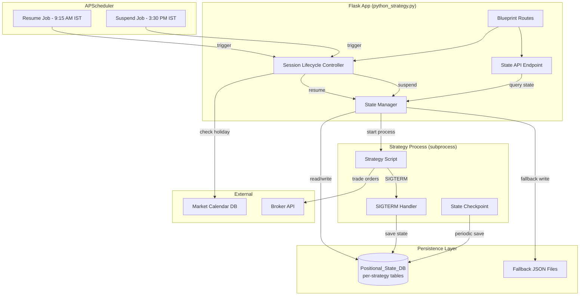

# Design Document: Positional Strategy Hosting

## Overview

This design extends the existing Python Strategy Hosting system (`blueprints/python_strategy.py`) to support positional (multi-day/multi-week) trading strategies for Indian stock markets. The core change is introducing **database-backed state persistence** using SQLAlchemy so that strategy state survives process termination across overnight suspensions, weekends, and market holidays.

The existing system manages strategy processes (start/stop/schedule) with in-memory state held in global dicts (`RUNNING_STRATEGIES`, `STRATEGY_CONFIGS`). Positional strategies require:

1. A per-strategy database table for state persistence
2. Market-aware session lifecycle (auto-resume at 9:15 AM IST, suspend at 3:30 PM IST)
3. SIGTERM-triggered state save in the strategy process itself
4. A state API endpoint for monitoring
5. No exit orders on suspend — positions stay open at broker

The design preserves backward compatibility: existing intraday strategies continue working unchanged. Only strategies configured as `strategy_type: "positional"` get the new lifecycle behaviour.

## Architecture



### Key Architectural Decisions

1. **Per-strategy tables** (`positional_state_{strategy_id}`) rather than a single shared table. Rationale: isolation between strategies, simpler cleanup when a strategy is deleted, no risk of cross-strategy data corruption.

2. **State serialization lives in the Strategy_Host** (not in the strategy script). The host serializes/deserializes on suspend/resume. The strategy process also writes checkpoints directly using the same serializer module.

3. **SIGTERM-based graceful suspend**: The host sends SIGTERM to the strategy process, which has 10 seconds to save state and exit. If it doesn't exit, the host force-kills and marks state as potentially stale.

4. **No position exits on suspend**: The Strategy_Host never places exit orders during suspend. Only the Strategy_Process places exits based on trading logic (SL, target, trailing SL, manual, time-based).

5. **Fallback file on DB failure**: If the database is unreachable during SIGTERM handling, state is written to `strategies/state/{strategy_id}_fallback.json`. On next startup, the host imports this into the DB.

## Components and Interfaces

### 1. PositionalStateDB Module (`database/positional_state_db.py`)

Responsibilities:
- Dynamic table creation per strategy_id
- CRUD operations for state key-value records
- Atomic state write (transaction-wrapped)
- Schema version management

```python
# Public interface
def create_strategy_table(strategy_id: str) -> bool
def save_state(strategy_id: str, state: dict, schema_version: int) -> bool
def load_state(strategy_id: str) -> dict | None
def delete_strategy_table(strategy_id: str) -> bool
def get_all_strategies_with_state() -> list[str]
```

### 2. StateSerializer Module (`services/positional_state_serializer.py`)

Responsibilities:
- Explicit field mapping for Strategy_State → JSON → Strategy_State
- Type preservation (int stays int, bool stays bool, None stays None)
- Float precision to 6 decimal places
- Validation on deserialization (missing fields, type mismatches)
- Schema version migration support

```python
# Public interface
def serialize_state(state: StrategyState) -> dict[str, str]
    """Converts StrategyState to dict of {state_key: json_string} for DB storage"""

def deserialize_state(records: dict[str, str], expected_version: int) -> StrategyState
    """Converts DB records back to StrategyState, validates types and completeness"""

def migrate_state(records: dict[str, str], from_version: int, to_version: int) -> dict[str, str]
    """Attempts automated migration between schema versions"""
```

### 3. Session Lifecycle Controller (in `blueprints/python_strategy.py`)

Responsibilities:
- Schedule resume/suspend jobs via APScheduler at 9:15 AM / 3:30 PM IST
- Check market calendar before resume (skip holidays/weekends)
- Coordinate state save → process stop on suspend
- Coordinate state load → process start on resume
- Handle resume failures (corrupted state, broker unavailability)

```python
# Key functions added to python_strategy.py
def schedule_positional_lifecycle(strategy_id: str) -> None
def positional_resume_all() -> None  # Scheduled at 9:15 AM IST
def positional_suspend_all() -> None  # Scheduled at 3:30 PM IST
def suspend_positional_strategy(strategy_id: str) -> tuple[bool, str]
def resume_positional_strategy(strategy_id: str) -> tuple[bool, str]
```

### 4. Configuration Validator (`services/positional_config_validator.py`)

Responsibilities:
- Validate positional strategy environment variables
- Check datetime format (YYYY-MM-DD HH:MM)
- Validate chronological ordering
- Validate CANDLE_TIMEFRAME_MIN against allowed values
- Default STRATEGY_PRODUCT to NRML for positional

```python
# Public interface
def validate_positional_config(env_vars: dict) -> tuple[bool, str | None]
    """Returns (is_valid, error_message)"""
```

### 5. State API Endpoint

Added to the existing blueprint at `GET /python/strategy/<strategy_id>/state`.

Returns current state (live from process if running, or from DB if suspended).

### 6. Strategy Process State Integration

The strategy script (e.g., TC_15min_Stocks.py) handles:
- SIGTERM handler that saves state to DB before exit
- Periodic checkpoint saves on each candle close
- Reading restored state from environment variables on startup

## Data Models

### PositionalState Table (per strategy: `positional_state_{strategy_id}`)

| Column | Type | Constraints | Description |
|--------|------|------------|-------------|
| id | Integer | PK, autoincrement | Row identifier |
| state_key | String(255) | NOT NULL, unique per table | State property name |
| state_value | Text(65535) | NOT NULL | JSON-encoded value |
| schema_version | Integer | NOT NULL | Version for migration support |
| created_at | DateTime | NOT NULL, default=now | First write timestamp |
| updated_at | DateTime | NOT NULL, default=now, onupdate=now | Last modification timestamp |

### StrategyState (runtime object)

```python
@dataclass
class StrategyState:
    # Metadata
    schema_version: int
    strategy_id: str
    timestamp: str  # ISO 8601

    # Candle data
    first_candle_high: float | None
    first_candle_low: float | None
    first_candle_close: float | None
    first_candle_mid: float | None

    # Trade state
    bias: str | None  # "BULLISH" | "BEARISH" | None
    entry_done: bool
    exit_done: bool
    option_symbol: str | None
    option_exchange: str | None
    actual_quantity: int | None
    entry_option_price_saved: float | None
    journal_trade_id: int | None
    sl_count: int
    cumulative_loss_pct: float
    high_watermark: float | None
    trailing_active: bool

    # Configuration snapshot
    config: dict  # All active STRATEGY_* values
```

### Strategy Configuration Extensions

The existing `STRATEGY_CONFIGS` JSON gains these fields for positional strategies:

```json
{
  "strategy_type": "positional",
  "positional_status": "suspended | running | error | state_save_failed | requires_manual_review | entry_expired | completed | suspended_stale",
  "entry_start_dt": "2025-07-30 09:15",
  "entry_end_dt": "2025-08-01 12:00",
  "exit_dt": "2025-08-15 15:15"
}
```


## Correctness Properties

*A property is a characteristic or behavior that should hold true across all valid executions of a system — essentially, a formal statement about what the system should do. Properties serve as the bridge between human-readable specifications and machine-verifiable correctness guarantees.*

### Property 1: State Serialization Round-Trip

*For any* valid StrategyState object (with arbitrary float values up to 6 decimal places, integers, booleans, None values, and strings), serializing it to the key-value DB format and then deserializing it back SHALL produce a field-by-field equivalent StrategyState where each field has the same type and value as the original.

**Validates: Requirements 9.2, 9.1, 9.4, 9.5, 1.5, 1.7, 8.2**

### Property 2: Deserialization Rejects Corrupted State

*For any* serialized state that is missing at least one required field, or has a non-nullable field set to null, or has a field value that cannot be parsed to the expected type, the deserializer SHALL raise a validation error that identifies the specific invalid fields rather than silently using defaults.

**Validates: Requirements 1.6, 9.6**

### Property 3: Datetime Parsing Validates Format

*For any* string that matches the pattern `YYYY-MM-DD HH:MM` with valid date and time components (valid month 01-12, valid day for that month, hour 00-23, minute 00-59), the configuration validator SHALL accept it. *For any* string that does NOT match this pattern, the validator SHALL reject it with an error identifying the invalid field.

**Validates: Requirements 2.2, 2.3, 2.4, 2.8**

### Property 4: Chronological Ordering Validation

*For any* triple of valid datetime values (entry_start, entry_end, exit_dt), the configuration validator SHALL accept them if and only if entry_start < entry_end < exit_dt. When the ordering constraint is violated, the error message SHALL identify which specific ordering constraint failed.

**Validates: Requirements 2.7, 2.9**

### Property 5: Candle Timeframe Allowlist Validation

*For any* integer value, the configuration validator SHALL accept CANDLE_TIMEFRAME_MIN if and only if the value is in the set {1, 2, 3, 5, 10, 15, 20, 30, 60}. For absent or empty values, it SHALL default to 15.

**Validates: Requirements 2.5, 2.10**

### Property 6: No Exit Orders on Suspend

*For any* positional strategy with an open position (entry_done=true, exit_done=false), when the Strategy_Host initiates suspension (market close or SIGTERM to main process), zero exit orders SHALL be placed to the broker. The position SHALL remain active at the broker after suspend completes.

**Validates: Requirements 3.5, 4.2, 4.3**

### Property 7: Skip Resume on Non-Trading Days

*For any* date that is a market holiday or a weekend (Saturday/Sunday) according to the Market Calendar, the positional auto-resume SHALL be skipped and the strategy status SHALL remain "suspended".

**Validates: Requirements 3.6, 3.8**

### Property 8: Stop-Loss Triggers on Opposite-Side Candle Cross

*For any* BULLISH trade with a defined first_candle_low, when a candle closes below first_candle_low, a stop-loss exit SHALL be triggered. *For any* BEARISH trade with a defined first_candle_high, when a candle closes above first_candle_high, a stop-loss exit SHALL be triggered. No other candle close conditions SHALL trigger a stop-loss exit.

**Validates: Requirements 4.4, 8.3**

### Property 9: Trailing Stop-Loss Activation at Target

*For any* active position where the option premium high watermark exceeds `entry_option_price_saved * (1 + STRATEGY_TARGET_PCT/100)` and `TRAIL_GAP > 0`, the trailing stop-loss mode SHALL be activated. The trailing floor SHALL be set to `high_watermark - TRAIL_GAP` and SHALL never drop below the activation price.

**Validates: Requirements 4.5, 8.6**

### Property 10: Trailing Stop-Loss Exit on Watermark Drop

*For any* position with trailing_active=true, when the current option premium drops below `high_watermark - TRAIL_GAP`, an exit order SHALL be triggered and exit_done SHALL be set to true.

**Validates: Requirements 4.6**

### Property 11: High Watermark Tracks Running Maximum

*For any* sequence of polled LTP values during an active position, the high_watermark after processing the sequence SHALL equal the maximum value in the sequence (or the initial high_watermark if all values are lower).

**Validates: Requirements 8.5**

### Property 12: Flip Re-Entry Only When Count Below Maximum

*For any* state where a stop-loss has been triggered, a direction flip and re-entry SHALL occur if and only if the current sl_count is strictly less than MAX_FLIP_ENTRIES. When sl_count >= MAX_FLIP_ENTRIES, exit_done SHALL be set to true with no re-entry.

**Validates: Requirements 8.4**

### Property 13: Atomic State Writes

*For any* state write operation, if the operation is interrupted (simulated crash/rollback), the database SHALL contain either the complete previous state or the complete new state — never a partial mix of old and new state_key values.

**Validates: Requirements 8.8**

### Property 14: Entry Window Datetime Check

*For any* datetime `t` and entry window defined by `[entry_start, entry_end]`, the entry window check SHALL return true if and only if `entry_start <= t <= entry_end`.

**Validates: Requirements 7.1**

### Property 15: State API Response Schema

*For any* valid persisted strategy state, the GET `/python/strategy/{strategy_id}/state` response SHALL contain: position_status (one of "no_position", "position_open", "position_closed"), entry_price (float), entry_timestamp (ISO 8601 string), instrument_symbol (string), quantity (integer), unrealized_pnl (float when position_open), and last_updated (ISO 8601 string).

**Validates: Requirements 6.6**

### Property 16: Schema Migration Produces Valid State

*For any* valid state serialized at schema version N-1, running the migration function SHALL produce a valid state at schema version N that passes all deserialization validation checks.

**Validates: Requirements 1.8**

## Error Handling

### Database Failures

| Scenario | Behaviour |
|----------|-----------|
| DB write fails during suspend | Retry 3 times (2s intervals). If all fail: log error, set status "state_save_failed", terminate process without deleting old state |
| DB write fails during SIGTERM (strategy process) | Write to fallback file `strategies/state/{strategy_id}_fallback.json`, log fallback location |
| DB read fails during resume | Set status "error" with failure reason, do NOT exit positions |
| Deserialization fails (missing fields, wrong types) | Set status "requires_manual_review", refuse auto-start |
| Schema migration fails | Set status "requires_manual_review", refuse auto-start, log affected state_keys |

### Process Failures

| Scenario | Behaviour |
|----------|-----------|
| Strategy process doesn't exit within 10s of SIGTERM | Force-kill (SIGKILL), set status "suspended_stale", log warning about potential state staleness |
| Strategy process doesn't terminate within 60s at market close | Force-terminate, save last captured state, set status "suspended" |
| Strategy process crashes unexpectedly | On next startup, detect persisted state with no process → set "suspended" |
| Fallback state file found on startup | Import into DB, delete fallback file |

### Trading Failures

| Scenario | Behaviour |
|----------|-----------|
| Option symbol expired (no longer in master contract) | Set status "requires_manual_review", log error, do NOT exit |
| Broker connectivity failure during resume | Set status "error", do NOT exit positions |
| Exit order placement fails | Do NOT mark exit_done=true, log error, continue monitoring for next trigger |

### Configuration Errors

| Scenario | Behaviour |
|----------|-----------|
| Missing/invalid datetime env vars | Refuse to start, log which field is invalid |
| Chronological ordering violated | Refuse to start, log which constraint failed |
| Invalid CANDLE_TIMEFRAME_MIN | Refuse to start, log the invalid value |

## Testing Strategy

### Property-Based Tests (using Hypothesis)

Property-based tests implement the correctness properties defined above. Each test runs minimum 100 iterations with randomized inputs.

**Library**: [Hypothesis](https://hypothesis.readthedocs.io/) (Python PBT library, already in use — `.hypothesis/` directory present in project root)

**Configuration**: 
- Minimum 100 examples per property test (`@settings(max_examples=100)`)
- Each test tagged with property reference comment

**Test file**: `test/test_positional_state_properties.py`

Tests to implement:
1. Round-trip serialization (Property 1)
2. Corrupted state rejection (Property 2)
3. Datetime format validation (Property 3)
4. Chronological ordering (Property 4)
5. Candle timeframe allowlist (Property 5)
6. No exit on suspend (Property 6)
7. Holiday/weekend skip (Property 7)
8. Stop-loss trigger logic (Property 8)
9. Trailing activation (Property 9)
10. Trailing exit trigger (Property 10)
11. High watermark tracking (Property 11)
12. Flip count guard (Property 12)
13. Atomic writes (Property 13)
14. Entry window check (Property 14)
15. API response schema (Property 15)
16. Schema migration validity (Property 16)

### Unit Tests (Example-Based)

**Test file**: `test/test_positional_state_unit.py`

- DB retry logic (mock failures for 1, 2, 3, 4 attempts)
- Fallback file write and recovery
- Strategy_type validation ("intraday" accepted, "positional" accepted, others rejected)
- STRATEGY_PRODUCT defaults to NRML for positional
- Suspend sets "suspended" status (distinct from "stopped")
- Force-kill after timeout sets "suspended_stale"
- Startup recovery (persisted state + no process → "suspended")
- Entry window expiry → "entry_expired"
- Manual exit via API → exit + "completed"
- Time-based exit at STRATEGY_EXIT_DATE_TIME
- API endpoint returns "no_state" for missing strategy
- API endpoint returns 403 for unauthorized access

### Integration Tests

**Test file**: `test/test_positional_integration.py`

- Full suspend→resume cycle with state verification
- Market calendar integration (skip holidays)
- SIGTERM handling in strategy process
- Fallback file import on startup
- Multi-day entry window (Day 1 no entry → Day 2 continues)
- Position monitoring resume with restored candle data

### Test Runner Configuration

```bash
# Run all positional strategy tests
pytest test/test_positional_state_properties.py test/test_positional_state_unit.py -v

# Run only property tests
pytest test/test_positional_state_properties.py -v

# Run with Hypothesis verbose output
pytest test/test_positional_state_properties.py -v --hypothesis-show-statistics
```

