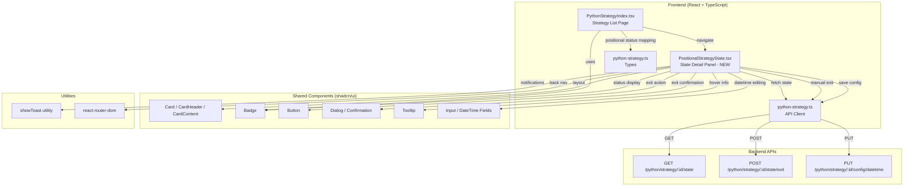

# Design Document: Positional Strategy State UI

## Overview

This design adds positional strategy awareness to the frontend React application. It extends the existing Python Strategy management UI with:

1. **Positional status badges** on the strategy list page — new amber/orange/blue badges for suspended, entry_expired, completed, suspended_stale, and requires_manual_review statuses
2. **A State Detail Panel** (`/python/:strategyId/state`) showing live position data, entry/exit prices, unrealized P&L, high watermark, and trailing stop-loss status
3. **Manual exit** functionality with destructive confirmation dialog
4. **Auto-refresh** polling (30s) with visibility-aware lifecycle
5. **Entry window progress** showing days remaining or "expired" indicator
6. **Editable datetime configuration** for entry/exit windows directly from the state panel

The design follows established patterns from `KillSwitch.tsx` (ArrowLeft back nav, Card layout, Badge for status, Button variants, toast notifications) and `PythonStrategyIndex.tsx` (SSE updates, STATUS_COLORS/STATUS_LABELS maps, Dialog for confirmations, Tooltip for hover info).

All backend APIs are already defined by the positional-strategy-hosting spec (GET `/python/strategy/<strategy_id>/state`, POST `/python/strategy/<strategy_id>/state/exit`). One new endpoint is needed for datetime config updates: `PUT /python/strategy/<strategy_id>/config/datetime`.

## Architecture



### Key Architectural Decisions

1. **New page component** at `frontend/src/pages/python-strategy/PositionalStrategyState.tsx` rather than a modal or expandable panel. Rationale: the state detail panel has substantial content (position data, entry window, datetime editing, manual exit) that warrants its own page with a dedicated URL for bookmarking and direct navigation.

2. **Route at `/python/:strategyId/state`** following the existing pattern (`/python/:strategyId/edit`, `/python/:strategyId/logs`, `/python/:strategyId/schedule`).

3. **Extend existing STATUS_COLORS/STATUS_LABELS maps** in `python-strategy.ts` types file rather than creating parallel maps. Positional statuses are added to the same Record<string, string> structures.

4. **Visibility-aware polling** using `document.visibilityState` and the `visibilitychange` event. When the tab is hidden, polling stops; when visible again, it resumes immediately and resets the interval.

5. **Conditional rendering based on `strategy_type`** field added to the PythonStrategy interface. The strategy list only shows positional badge colours for `strategy_type === "positional"` strategies.

6. **Optimistic UI for exit action**: After successful exit API call, immediately show success toast and refetch state rather than optimistically updating local state (since position closure has complex backend side effects).

## Components and Interfaces

### 1. Extended Type Definitions (`frontend/src/types/python-strategy.ts`)

```typescript
// New positional status type
export type PositionalStatus =
  | 'suspended'
  | 'running'
  | 'error'
  | 'state_save_failed'
  | 'requires_manual_review'
  | 'entry_expired'
  | 'completed'
  | 'suspended_stale'

// Extend PythonStrategy interface
export interface PythonStrategy {
  // ... existing fields ...
  strategy_type?: 'intraday' | 'positional'  // NEW
  positional_status?: PositionalStatus        // NEW - only for positional strategies
}

// State API response type
export interface PositionalState {
  position_status: 'no_position' | 'position_open' | 'position_closed'
  entry_price: number | null
  entry_timestamp: string | null  // ISO 8601
  instrument_symbol: string | null
  quantity: number | null
  unrealized_pnl: number | null
  high_watermark: number | null
  trailing_active: boolean
  last_updated: string  // ISO 8601
  is_live: boolean
  entry_window: {
    start: string  // YYYY-MM-DD HH:MM
    end: string    // YYYY-MM-DD HH:MM
    exit_dt: string  // YYYY-MM-DD HH:MM
  } | null
}

// Datetime config update request
export interface DatetimeConfigUpdate {
  entry_start_dt?: string  // YYYY-MM-DD HH:MM
  entry_end_dt?: string    // YYYY-MM-DD HH:MM
  exit_dt?: string         // YYYY-MM-DD HH:MM
}

// Extended status maps
export const POSITIONAL_STATUS_COLORS: Record<PositionalStatus, string> = {
  suspended: 'bg-amber-500',
  running: 'bg-green-500',
  error: 'bg-red-500',
  state_save_failed: 'bg-red-500',
  requires_manual_review: 'bg-red-500',
  entry_expired: 'bg-orange-500',
  completed: 'bg-blue-500',
  suspended_stale: 'bg-amber-500',
}

export const POSITIONAL_STATUS_LABELS: Record<PositionalStatus, string> = {
  suspended: 'Suspended',
  running: 'Running',
  error: 'Error',
  state_save_failed: 'State Save Failed',
  requires_manual_review: 'Needs Review',
  entry_expired: 'Entry Expired',
  completed: 'Completed',
  suspended_stale: 'Suspended (Stale)',
}

export const POSITIONAL_STATUS_TOOLTIPS: Partial<Record<PositionalStatus, string>> = {
  suspended_stale: 'Last state save may be incomplete. Verify position manually.',
  requires_manual_review: 'Manual intervention required. Check logs for details.',
}
```

### 2. API Client Extensions (`frontend/src/api/python-strategy.ts`)

```typescript
// New methods added to pythonStrategyApi object
export const pythonStrategyApi = {
  // ... existing methods ...

  /**
   * Get positional strategy state
   */
  getPositionalState: async (strategyId: string): Promise<PositionalState> => {
    const response = await webClient.get<PositionalState>(
      `/python/strategy/${strategyId}/state`
    )
    return response.data
  },

  /**
   * Trigger manual position exit
   */
  exitPosition: async (strategyId: string): Promise<ApiResponse<void>> => {
    const response = await webClient.post<ApiResponse<void>>(
      `/python/strategy/${strategyId}/state/exit`
    )
    return response.data
  },

  /**
   * Update datetime configuration
   */
  updateDatetimeConfig: async (
    strategyId: string,
    config: DatetimeConfigUpdate
  ): Promise<ApiResponse<void>> => {
    const response = await webClient.put<ApiResponse<void>>(
      `/python/strategy/${strategyId}/config/datetime`,
      config
    )
    return response.data
  },
}
```

### 3. PositionalStrategyState Page Component

**Location**: `frontend/src/pages/python-strategy/PositionalStrategyState.tsx`

**Responsibilities**:
- Fetch and display positional state from State_API
- Auto-refresh every 30s with visibility awareness
- Show manual exit button + confirmation dialog
- Display entry window progress (days remaining / expired)
- Editable datetime fields with validation
- Back navigation to strategy list

**Component Structure**:
```
PositionalStrategyState
├── Header (ArrowLeft back nav + strategy name + positional status badge)
├── State Card (position details or "no position" message)
│   ├── Position Info (entry_price, instrument, quantity, timestamp)
│   ├── P&L Display (unrealized_pnl with colour coding)
│   └── Trailing Info (high_watermark, trailing_active indicator)
├── Entry Window Card (progress / expired indicator)
│   ├── Days Remaining or "Entry Expired" badge
│   └── Entry window date range display
├── Datetime Config Card (editable fields)
│   ├── Entry Start / End / Exit datetime inputs
│   ├── Validation messages
│   └── Save button
├── Actions Card (manual exit)
│   └── Manual Exit Button (destructive, conditional)
├── Live/Snapshot Notice (is_live indicator)
└── Confirmation Dialog (exit confirmation)
```

### 4. PythonStrategyIndex Modifications

**Changes needed**:
- Read `strategy_type` and `positional_status` from strategy data
- For positional strategies, use `POSITIONAL_STATUS_COLORS` and `POSITIONAL_STATUS_LABELS` instead of the default maps
- Add a click handler on positional strategy cards that navigates to `/python/:strategyId/state`
- Add tooltip content for `suspended_stale` and `requires_manual_review` statuses

### 5. Utility Functions

**Date/time formatting** (in component or separate util):
```typescript
// Format currency in INR
function formatINR(value: number): string

// Format ISO timestamp to IST display (DD MMM YYYY HH:MM)
function formatIST(isoString: string): string

// Calculate days remaining from now to end date
function getDaysRemaining(endDateStr: string): number

// Pluralize "day"/"days"
function pluralizeDays(n: number): string

// Validate YYYY-MM-DD HH:MM format
function isValidDatetimeFormat(value: string): boolean

// Validate chronological ordering
function isChronologicalOrder(start: string, end: string, exit: string): boolean
```

## Data Models

### PositionalState API Response (GET `/python/strategy/:id/state`)

| Field | Type | Description |
|-------|------|-------------|
| position_status | `"no_position" \| "position_open" \| "position_closed"` | Current position state |
| entry_price | `number \| null` | Entry price in INR (null if no position) |
| entry_timestamp | `string \| null` | ISO 8601 timestamp of entry |
| instrument_symbol | `string \| null` | Option/instrument symbol |
| quantity | `number \| null` | Position quantity |
| unrealized_pnl | `number \| null` | Current unrealized P&L (null if not live) |
| high_watermark | `number \| null` | Highest premium since entry |
| trailing_active | `boolean` | Whether trailing SL mode is active |
| last_updated | `string` | ISO 8601 timestamp of last data update |
| is_live | `boolean` | true if strategy process is running, false if showing persisted state |
| entry_window | `object \| null` | Entry window config (start, end, exit_dt) |

### DatetimeConfigUpdate Request (PUT `/python/strategy/:id/config/datetime`)

| Field | Type | Required | Description |
|-------|------|----------|-------------|
| entry_start_dt | `string` | Optional | New STRATEGY_ENTRY_START_DATE_TIME (YYYY-MM-DD HH:MM) |
| entry_end_dt | `string` | Optional | New STRATEGY_ENTRY_END_DATE_TIME (YYYY-MM-DD HH:MM) |
| exit_dt | `string` | Optional | New STRATEGY_EXIT_DATE_TIME (YYYY-MM-DD HH:MM) |

### PythonStrategy Interface Extension

| Field | Type | Description |
|-------|------|-------------|
| strategy_type | `"intraday" \| "positional" \| undefined` | Strategy type (undefined = intraday for backward compat) |
| positional_status | `PositionalStatus \| undefined` | Current positional lifecycle status |

### Route Configuration

New route added to `App.tsx`:
```
/python/:strategyId/state → PositionalStrategyState
```

## Correctness Properties

*A property is a characteristic or behavior that should hold true across all valid executions of a system — essentially, a formal statement about what the system should do. Properties serve as the bridge between human-readable specifications and machine-verifiable correctness guarantees.*

### Property 1: Positional Status Badge Mapping Completeness

*For any* valid `PositionalStatus` value (from the set: suspended, running, error, state_save_failed, requires_manual_review, entry_expired, completed, suspended_stale), the status-to-badge mapping SHALL return a non-empty label string and a non-empty colour class string, and the label SHALL match the defined POSITIONAL_STATUS_LABELS mapping exactly.

**Validates: Requirements 1.1, 1.2, 1.3, 1.4, 1.5, 1.6**

### Property 2: Strategy Type Gating for Badge Selection

*For any* strategy object, the positional status badge mapping SHALL be used if and only if `strategy_type === "positional"`. For all other `strategy_type` values (including undefined), the existing STATUS_COLORS/STATUS_LABELS maps SHALL be used.

**Validates: Requirements 1.7**

### Property 3: Manual Exit Button Visibility

*For any* `position_status` value, the Manual Exit button SHALL be visible if and only if `position_status === "position_open"`. For "no_position" and "position_closed", the button SHALL not be rendered.

**Validates: Requirements 3.1, 3.6**

### Property 4: Exit Confirmation Dialog Text Interpolation

*For any* instrument_symbol string and quantity integer, the confirmation dialog text SHALL contain both the exact instrument_symbol value and the exact quantity value formatted as an integer within the sentence template.

**Validates: Requirements 3.2**

### Property 5: Days Remaining Calculation and Pluralization

*For any* pair of (current_datetime, entry_end_datetime) where current_datetime is before entry_end_datetime, the days remaining calculation SHALL return a positive integer equal to the ceiling of the calendar day difference, and the display text SHALL use "day" (singular) when the result is 1 and "days" (plural) when the result is greater than 1.

**Validates: Requirements 5.1, 5.2, 5.3**

### Property 6: Date Formatting to DD MMM YYYY

*For any* valid ISO 8601 datetime string, the date formatting function SHALL produce a string matching the pattern "DD MMM YYYY" where DD is zero-padded day (01-31), MMM is abbreviated month name (Jan-Dec), and YYYY is the four-digit year.

**Validates: Requirements 5.6**

### Property 7: Datetime Format Validation

*For any* input string, the datetime validator SHALL accept it if and only if it matches the pattern `YYYY-MM-DD HH:MM` with valid components (month 01-12, day valid for that month, hour 00-23, minute 00-59). All other strings SHALL be rejected.

**Validates: Requirements 6.2**

### Property 8: Chronological Ordering Validation

*For any* triple of valid datetime strings (entry_start, entry_end, exit_dt), the chronological validator SHALL return true if and only if entry_start < entry_end < exit_dt (strictly ascending). When the constraint is violated, it SHALL identify which specific pair is out of order.

**Validates: Requirements 6.3**

### Property 9: Future Datetime Validation for Exit

*For any* exit datetime value and current datetime, the future validator SHALL accept the exit datetime if and only if it represents a time strictly after the current datetime.

**Validates: Requirements 6.8**

### Property 10: No Re-render on Unchanged State

*For any* two consecutive API responses, if both have the same `last_updated` timestamp value, the state data SHALL NOT be updated (preventing unnecessary re-renders).

**Validates: Requirements 4.7**

### Property 11: Currency Formatting for P&L Display

*For any* numeric unrealized_pnl value, the formatted display SHALL use green colour class for values > 0, red colour class for values < 0, and the value SHALL be formatted with INR currency notation (2 decimal places). Zero values SHALL use a neutral colour.

**Validates: Requirements 2.4**

## Error Handling

### API Errors

| Scenario | Behaviour |
|----------|-----------|
| State_API returns 404 (strategy not found) | Show "Strategy not found" error with back link to strategy list |
| State_API returns 403 (unauthorized) | Show "Access denied" error, suggest re-login |
| State_API returns 500 (server error) | Show generic error message with retry button |
| State_API network timeout | Show "Connection timeout" with retry button, retain last data if available |
| Exit_API returns error | Show error toast with backend message, keep current state unchanged |
| Config_API returns error | Show error toast, revert datetime fields to last saved values |
| Config_API returns 409 (conflict - strategy running) | Show toast explaining config cannot be changed while running |

### Validation Errors

| Scenario | Behaviour |
|----------|-----------|
| Invalid datetime format in input | Inline red error text below the field: "Invalid format. Use YYYY-MM-DD HH:MM" |
| Chronological ordering violated | Inline error identifying the constraint: "Entry end must be after entry start" or "Exit must be after entry end" |
| Exit datetime in the past | Inline error: "Exit datetime must be in the future" |
| All three constraints violated | Show all applicable errors simultaneously |

### UI State Errors

| Scenario | Behaviour |
|----------|-----------|
| Auto-refresh poll fails | Retain last displayed data, show subtle "Data may be stale" warning badge, continue next poll |
| Multiple rapid exit clicks | Button disabled during request, prevent duplicate calls |
| Navigation during exit request | Let request complete in background, don't cancel |
| State panel opened for non-positional strategy | Show message: "State panel is only available for positional strategies" with back link |

## Testing Strategy

### Property-Based Tests (using fast-check)

Property-based tests validate the correctness properties defined above. The frontend uses TypeScript, so [fast-check](https://github.com/dubzzz/fast-check) is the appropriate PBT library.

**Library**: fast-check (TypeScript/JavaScript PBT library)

**Configuration**:
- Minimum 100 iterations per property test (`{ numRuns: 100 }`)
- Each test tagged with property reference comment
- Tag format: **Feature: positional-strategy-state-ui, Property {number}: {property_text}**

**Test file**: `frontend/src/pages/python-strategy/__tests__/positional-state.property.test.ts`

Tests to implement:
1. Status badge mapping completeness (Property 1)
2. Strategy type gating (Property 2)
3. Manual exit button visibility (Property 3)
4. Exit dialog text interpolation (Property 4)
5. Days remaining + pluralization (Property 5)
6. Date formatting DD MMM YYYY (Property 6)
7. Datetime format validation (Property 7)
8. Chronological ordering validation (Property 8)
9. Future datetime validation (Property 9)
10. No re-render on unchanged state (Property 10)
11. Currency formatting with P&L colour (Property 11)

### Unit Tests (Example-Based)

**Test file**: `frontend/src/pages/python-strategy/__tests__/positional-state.test.tsx`

- State panel renders loading spinner initially
- State panel shows "no position" message when position_status is "no_position"
- State panel shows position details when position_status is "position_open"
- State panel shows "Position Closed" when position_status is "position_closed"
- Error state shows retry button and no stale data
- Back navigation link renders with correct href
- is_live=false shows "persisted snapshot" notice
- Manual exit button hidden when no position
- Confirmation dialog shows on exit button click
- Success toast on exit API success + state refresh
- Error toast on exit API failure, state unchanged
- Exit button disabled during loading
- Manual refresh button triggers immediate fetch
- Entry window "Entry Expired" display when past end date
- Datetime fields are read-only when position is open (except exit_dt)
- Datetime fields are all editable when no position
- Save button calls config API with correct payload
- Field revert on save error
- Positional strategy card in list navigates to /python/:id/state

### Integration Tests

**Test file**: `frontend/src/pages/python-strategy/__tests__/positional-state.integration.test.tsx`

- Auto-refresh polls every 30 seconds (fake timers)
- Polling stops on visibility hidden
- Polling resumes on visibility visible
- Full exit flow: click → confirm → API → toast → refresh
- Full config edit flow: edit → validate → save → toast
- Strategy list shows positional badges for positional strategies only
