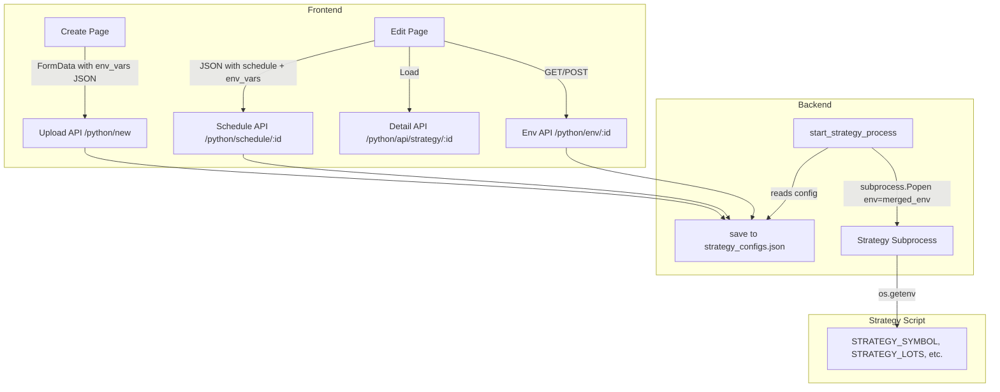

# Design Document: Per-Strategy Environment Variables

## Overview

This feature adds a configurable "Strategy Parameters" section to the Python Strategy create and edit pages, allowing traders to specify per-strategy trading parameters (symbol, strike, lots, times, product, exchange) via a structured UI. These parameters are stored in the strategy config JSON and injected as environment variables into the strategy subprocess at launch time, enabling scripts to read them with `os.getenv()`.

### Design Decisions

1. **Inline storage in `strategy_configs.json`** rather than a separate file — keeps the config atomic and avoids sync issues between files.
2. **Merged environment approach** (parent + strategy) rather than isolated env — strategies still inherit `OPENALGO_APIKEY`, `PATH`, and other system variables they need.
3. **Strategy overrides parent** for conflicting keys — gives users explicit control without modifying global state.
4. **All fields optional with empty defaults** — existing strategies continue to work unchanged; scripts provide their own defaults via `os.getenv("KEY", "default")`.
5. **Env vars sent with schedule update** rather than a separate endpoint — simplifies the edit page to a single form submission. The existing `getEnvVariables`/`saveEnvVariables` stubs in the API client will be used for the dedicated GET/POST `/python/env/<strategyId>` endpoints for programmatic access.

## Architecture



### Data Flow

1. **Create**: User fills form → frontend sends `env_vars` as JSON string in FormData → backend parses, filters empty values, stores in config.
2. **Edit**: Frontend loads strategy detail (includes `env_vars`) → pre-fills form → user modifies → submits schedule + env_vars → backend updates config.
3. **Launch**: `start_strategy_process()` reads config → merges `os.environ` with `config["env_vars"]` → passes to `subprocess.Popen(env=merged)`.

## Components and Interfaces

### Backend Components

#### 1. Environment Variable Validation (`validate_env_vars`)

```python
def validate_env_vars(env_vars: any) -> tuple[bool, str | None, dict[str, str]]:
    """
    Validate and sanitize environment variables from request data.
    
    Args:
        env_vars: Raw env_vars data from request (could be any type)
    
    Returns:
        (is_valid, error_message, sanitized_dict)
        - is_valid: True if validation passed
        - error_message: Human-readable error if invalid, None otherwise
        - sanitized_dict: Filtered dict with only non-empty string values
    """
```

**Logic:**
1. If `env_vars` is None or missing → return `(True, None, {})`
2. If `env_vars` is not a dict → return `(False, "env_vars must be a dictionary", {})`
3. For each key-value pair:
   - If key is not a string → return `(False, "env_vars keys must be strings", {})`
   - If value is not a string → return `(False, "env_vars values must be strings", {})`
4. Filter out entries where value is empty string
5. Return `(True, None, filtered_dict)`

#### 2. Environment Merge (`build_subprocess_env`)

```python
def build_subprocess_env(strategy_env_vars: dict[str, str]) -> dict[str, str]:
    """
    Build the environment dictionary for a strategy subprocess.
    
    Merges the current process environment with strategy-specific env vars.
    Strategy values override parent values for conflicting keys.
    All values are converted to strings.
    
    Args:
        strategy_env_vars: Dict of strategy-specific environment variables
    
    Returns:
        Complete environment dict for subprocess.Popen(env=...)
    """
```

**Logic:**
```python
def build_subprocess_env(strategy_env_vars: dict[str, str]) -> dict[str, str]:
    env = os.environ.copy()
    for key, value in strategy_env_vars.items():
        env[key] = str(value)
    return env
```

#### 3. Updated Route: `new_strategy()` (POST `/python/new`)

**Changes:**
- Parse `env_vars` from form data: `request.form.get("env_vars", "{}")`
- JSON-decode, validate via `validate_env_vars()`
- On validation failure, return 400 error
- Store in config under `"env_vars"` key

```python
# In the POST handler, after parsing schedule fields:
raw_env_vars = request.form.get("env_vars", "{}")
try:
    env_vars_data = json.loads(raw_env_vars)
except json.JSONDecodeError:
    return jsonify({"status": "error", "message": "Invalid env_vars JSON"}), 400

is_valid, error_msg, sanitized_vars = validate_env_vars(env_vars_data)
if not is_valid:
    return jsonify({"status": "error", "message": error_msg}), 400

# Add to config:
STRATEGY_CONFIGS[strategy_id]["env_vars"] = sanitized_vars
```

#### 4. Updated Route: `schedule_strategy_route()` (POST `/python/schedule/<strategy_id>`)

**Changes:**
- Accept optional `env_vars` in JSON body
- Validate and store if present

```python
data = request.json
# ... existing schedule handling ...

# Handle env_vars update
if "env_vars" in data:
    is_valid, error_msg, sanitized_vars = validate_env_vars(data["env_vars"])
    if not is_valid:
        return jsonify({"status": "error", "message": error_msg}), 400
    STRATEGY_CONFIGS[strategy_id]["env_vars"] = sanitized_vars
    save_configs()
```

#### 5. Updated Route: `api_get_strategy()` (GET `/python/api/strategy/<strategy_id>`)

**Changes:**
- Include `env_vars` in response JSON

```python
# In the response dict:
"env_vars": config.get("env_vars", {}),
```

#### 6. New Routes: Environment Variable API

```python
@python_strategy_bp.route("/env/<strategy_id>", methods=["GET"])
@check_session_validity
def get_env_vars(strategy_id):
    """Get environment variables for a strategy"""
    # Verify ownership
    # Return: {"regular": config.get("env_vars", {}), "secure": {}}

@python_strategy_bp.route("/env/<strategy_id>", methods=["POST"])
@check_session_validity
def save_env_vars(strategy_id):
    """Save environment variables for a strategy"""
    # Verify ownership
    # Check not running
    # Validate env_vars from request body
    # Store and save
```

#### 7. Updated Function: `start_strategy_process()`

**Changes:**
- After building subprocess args, build merged environment
- Pass `env` to `subprocess.Popen`

```python
# Before subprocess.Popen call:
strategy_env_vars = config.get("env_vars", {})
merged_env = build_subprocess_env(strategy_env_vars)
subprocess_args["env"] = merged_env

# Log which strategy vars are being injected (keys only, not values)
if strategy_env_vars:
    logger.info(f"Injecting env vars: {list(strategy_env_vars.keys())}")
```

### Frontend Components

#### 1. Strategy Parameters Form Section (`StrategyParametersSection`)

A reusable React component used in both Create and Edit pages.

```typescript
interface StrategyParametersProps {
  values: StrategyEnvVars
  onChange: (values: StrategyEnvVars) => void
  disabled?: boolean
  errors?: Record<string, string>
}

interface StrategyEnvVars {
  STRATEGY_SYMBOL: string
  STRATEGY_STRIKE: string
  STRATEGY_LOTS: string
  STRATEGY_ENTRY_START: string
  STRATEGY_ENTRY_END: string
  STRATEGY_EXIT_TIME: string
  STRATEGY_PRODUCT: string
  STRATEGY_EXCHANGE: string
}
```

**Field Definitions:**

| Field | Label | Type | Options | Env Var |
|-------|-------|------|---------|---------|
| Symbol | Symbol | text input | free text | `STRATEGY_SYMBOL` |
| Strike | Strike Selection | select | ITM5..ATM..OTM5 | `STRATEGY_STRIKE` |
| Lots | Lots | number input (min=1) | - | `STRATEGY_LOTS` |
| Entry Start | Entry Start Time | time input (HH:MM) | - | `STRATEGY_ENTRY_START` |
| Entry End | Entry End Time | time input (HH:MM) | - | `STRATEGY_ENTRY_END` |
| Exit Time | Exit Time | time input (HH:MM) | - | `STRATEGY_EXIT_TIME` |
| Product | Product | select | MIS, NRML | `STRATEGY_PRODUCT` |
| Exchange | Exchange | select | NFO, BFO, MCX, CDS | `STRATEGY_EXCHANGE` |

#### 2. Validation Functions

```typescript
// frontend/src/utils/strategy-env-validation.ts

export function validateLots(value: string): string | null {
  if (!value) return null  // optional field
  const num = parseInt(value, 10)
  if (isNaN(num) || num < 1 || !Number.isInteger(Number(value))) {
    return 'Lots must be a positive integer (minimum 1)'
  }
  return null
}

export function validateTimeFormat(value: string): string | null {
  if (!value) return null  // optional field
  const timeRegex = /^([01]\d|2[0-3]):([0-5]\d)$/
  if (!timeRegex.test(value)) {
    return 'Time must be in HH:MM format (00:00 - 23:59)'
  }
  return null
}
```

#### 3. Field-to-Variable Mapping

```typescript
// Constant mapping used for converting form state to env_vars dict
export const STRATEGY_FIELD_MAP: Record<string, string> = {
  symbol: 'STRATEGY_SYMBOL',
  strike: 'STRATEGY_STRIKE',
  lots: 'STRATEGY_LOTS',
  entryStart: 'STRATEGY_ENTRY_START',
  entryEnd: 'STRATEGY_ENTRY_END',
  exitTime: 'STRATEGY_EXIT_TIME',
  product: 'STRATEGY_PRODUCT',
  exchange: 'STRATEGY_EXCHANGE',
}

export function formStateToEnvVars(state: StrategyEnvVars): Record<string, string> {
  const result: Record<string, string> = {}
  for (const [fieldKey, envKey] of Object.entries(STRATEGY_FIELD_MAP)) {
    const value = state[envKey]
    if (value && value.trim()) {
      result[envKey] = value.trim()
    }
  }
  return result
}

export function envVarsToFormState(envVars: Record<string, string>): StrategyEnvVars {
  return {
    STRATEGY_SYMBOL: envVars['STRATEGY_SYMBOL'] || '',
    STRATEGY_STRIKE: envVars['STRATEGY_STRIKE'] || '',
    STRATEGY_LOTS: envVars['STRATEGY_LOTS'] || '',
    STRATEGY_ENTRY_START: envVars['STRATEGY_ENTRY_START'] || '',
    STRATEGY_ENTRY_END: envVars['STRATEGY_ENTRY_END'] || '',
    STRATEGY_EXIT_TIME: envVars['STRATEGY_EXIT_TIME'] || '',
    STRATEGY_PRODUCT: envVars['STRATEGY_PRODUCT'] || '',
    STRATEGY_EXCHANGE: envVars['STRATEGY_EXCHANGE'] || '',
  }
}
```

#### 4. Updated `uploadStrategy` API Call

```typescript
uploadStrategy: async (
  name: string,
  file: File,
  schedule: { start_time: string; stop_time: string; days: string[] },
  envVars?: Record<string, string>
): Promise<ApiResponse<{ strategy_id: string }>> => {
  const formData = new FormData()
  formData.append('strategy_name', name)
  formData.append('strategy_file', file)
  formData.append('schedule_start', schedule.start_time)
  formData.append('schedule_stop', schedule.stop_time)
  formData.append('schedule_days', JSON.stringify(schedule.days))
  if (envVars && Object.keys(envVars).length > 0) {
    formData.append('env_vars', JSON.stringify(envVars))
  }
  // ...
}
```

#### 5. Updated `scheduleStrategy` API Call

```typescript
scheduleStrategy: async (
  strategyId: string,
  config: ScheduleConfig & { env_vars?: Record<string, string> }
): Promise<ApiResponse<void>> => {
  // ...
}
```

## Data Models

### Strategy Config (in `strategy_configs.json`)

```json
{
  "first_min_candle_nifty_20250101120000": {
    "name": "First Min Candle Nifty",
    "file_path": "/path/to/strategies/first_min_candle_nifty_20250101120000.py",
    "file_name": "first_min_candle_nifty_20250101120000.py",
    "is_running": false,
    "is_scheduled": true,
    "created_at": "2025-01-01T12:00:00",
    "user_id": "user123",
    "schedule_start": "09:15",
    "schedule_stop": "15:30",
    "schedule_days": ["mon", "tue", "wed", "thu", "fri"],
    "env_vars": {
      "STRATEGY_SYMBOL": "NIFTY",
      "STRATEGY_STRIKE": "ITM2",
      "STRATEGY_LOTS": "1",
      "STRATEGY_ENTRY_START": "09:16",
      "STRATEGY_ENTRY_END": "10:30",
      "STRATEGY_EXIT_TIME": "15:15",
      "STRATEGY_PRODUCT": "MIS",
      "STRATEGY_EXCHANGE": "NFO"
    }
  }
}
```

### API Request/Response Models

**POST `/python/new` (FormData):**
```
strategy_name: string
strategy_file: File
schedule_start: string (HH:MM)
schedule_stop: string (HH:MM)
schedule_days: string (JSON array)
env_vars: string (JSON object, optional)
```

**POST `/python/schedule/<strategy_id>` (JSON):**
```json
{
  "start_time": "09:15",
  "stop_time": "15:30",
  "days": ["mon", "tue", "wed", "thu", "fri"],
  "env_vars": {
    "STRATEGY_SYMBOL": "BANKNIFTY",
    "STRATEGY_LOTS": "2"
  }
}
```

**GET `/python/api/strategy/<strategy_id>` (Response, updated):**
```json
{
  "strategy": {
    "id": "...",
    "name": "...",
    "env_vars": {
      "STRATEGY_SYMBOL": "NIFTY",
      "STRATEGY_LOTS": "1"
    },
    "...other fields..."
  }
}
```

**GET `/python/env/<strategy_id>` (Response):**
```json
{
  "regular": {
    "STRATEGY_SYMBOL": "NIFTY",
    "STRATEGY_LOTS": "1"
  },
  "secure": {}
}
```

**POST `/python/env/<strategy_id>` (Request):**
```json
{
  "regular": {
    "STRATEGY_SYMBOL": "BANKNIFTY",
    "STRATEGY_LOTS": "2"
  },
  "secure": {}
}
```

## Correctness Properties

*A property is a characteristic or behavior that should hold true across all valid executions of a system — essentially, a formal statement about what the system should do. Properties serve as the bridge between human-readable specifications and machine-verifiable correctness guarantees.*

### Property 1: Config Storage Round-Trip

*For any* valid env_vars dictionary (containing only non-empty string keys and non-empty string values), storing it in the strategy config and retrieving it via the detail API should return the same dictionary.

**Validates: Requirements 3.1, 3.2, 3.3, 3.4**

### Property 2: Empty Value Filtering

*For any* env_vars dictionary containing a mix of empty-string and non-empty-string values, after storage in the strategy config, the stored `env_vars` field should contain only entries with non-empty string values (all empty values are excluded).

**Validates: Requirements 3.6**

### Property 3: Environment Merge Correctness

*For any* parent environment dictionary and any strategy env_vars dictionary, the merged environment produced by `build_subprocess_env` should satisfy: (a) every key from the parent environment is present in the result, (b) every key from the strategy env_vars is present in the result, (c) for any key present in both, the result contains the strategy's value, and (d) all values in the result are strings.

**Validates: Requirements 4.1, 4.3, 4.4, 4.5**

### Property 4: Lots Validation

*For any* string input, the lots validation function should return success if and only if the string represents a positive integer greater than or equal to 1 (with no leading zeros, no decimals, no negative values).

**Validates: Requirements 5.1**

### Property 5: Time Format Validation

*For any* string input, the time format validation function should return success if and only if the string matches the pattern HH:MM where HH is 00-23 and MM is 00-59.

**Validates: Requirements 5.2**

### Property 6: API Env Vars Type Validation

*For any* input value passed as `env_vars`, the validation function should accept it if and only if it is a dictionary with all string keys and all string values (or is absent/None, which defaults to empty dict).

**Validates: Requirements 5.4, 5.5**

### Property 7: Field-to-Variable Name Mapping

*For any* set of form field values, the `formStateToEnvVars` function should produce a dictionary where: Symbol maps to `STRATEGY_SYMBOL`, Strike maps to `STRATEGY_STRIKE`, Lots maps to `STRATEGY_LOTS`, Entry Start maps to `STRATEGY_ENTRY_START`, Entry End maps to `STRATEGY_ENTRY_END`, Exit Time maps to `STRATEGY_EXIT_TIME`, Product maps to `STRATEGY_PRODUCT`, and Exchange maps to `STRATEGY_EXCHANGE` — with empty values excluded.

**Validates: Requirements 6.1, 6.2, 6.3, 6.4, 6.5, 6.6, 6.7, 6.8**

## Error Handling

### Backend Errors

| Scenario | Response Code | Message |
|----------|--------------|---------|
| Invalid JSON in `env_vars` form field | 400 | "Invalid env_vars JSON" |
| `env_vars` is not a dict | 400 | "env_vars must be a dictionary" |
| Non-string key in `env_vars` | 400 | "env_vars keys must be strings" |
| Non-string value in `env_vars` | 400 | "env_vars values must be strings" |
| Strategy not found | 404 | "Strategy not found" |
| Strategy running (edit attempt) | 400 | "Cannot modify while strategy is running" |
| Unauthorized access | 401 | "Session expired" |
| Ownership mismatch | 403 | "Access denied" |

### Frontend Errors

| Scenario | Behavior |
|----------|----------|
| Invalid lots value | Inline error: "Lots must be a positive integer (minimum 1)" |
| Invalid time format | Inline error: "Time must be in HH:MM format (00:00 - 23:59)" |
| API returns 400 | Toast notification with server error message |
| Network failure | Toast notification: "Failed to save strategy parameters" |

### Subprocess Launch Errors

- If `env_vars` in config is corrupted (not a dict), treat as empty dict and log a warning
- Environment merge failure should not prevent strategy launch — fall back to parent env only and log error

## Testing Strategy

### Property-Based Tests (Python - Hypothesis)

Property-based testing is appropriate for this feature because the core logic involves pure functions (validation, merging, mapping) with clear input/output behavior and large input spaces.

**Library:** [Hypothesis](https://hypothesis.readthedocs.io/) for Python backend tests
**Minimum iterations:** 100 per property

Each property test should be tagged with:
```python
# Feature: python-strategy-env-vars, Property N: <property text>
```

**Properties to implement:**
1. Config storage round-trip
2. Empty value filtering
3. Environment merge correctness
4. Lots validation
5. Time format validation
6. API env_vars type validation
7. Field-to-variable name mapping (TypeScript — fast-check)

### Unit Tests

- Backend: Test each new/modified route handler with specific examples
  - Upload with env_vars present
  - Upload without env_vars (defaults to `{}`)
  - Schedule update with env_vars
  - GET strategy includes env_vars
  - GET/POST `/python/env/<id>` endpoints
- Frontend: Test StrategyParametersSection component renders correct fields
  - All fields present with correct labels
  - Disabled state when strategy is running
  - Pre-fill with existing values

### Integration Tests

- End-to-end flow: Create strategy with params → start → verify subprocess received env vars
- Edit params → restart → verify new values propagated
- Verify the existing `getEnvVariables`/`saveEnvVariables` API stubs work with the new endpoints
