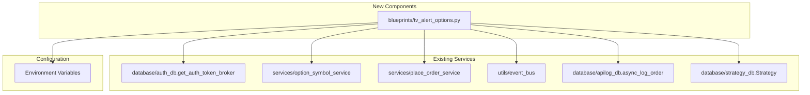

# Design Document: TV Alert Options Trading

## Overview

This feature adds an automated options trading pipeline triggered by TradingView webhook alerts. When a webhook arrives with a SPOT chart type, the system resolves the appropriate ITM2 option strike from the database, constructs a bracket order with stop-loss and target, and places it through the existing broker infrastructure.

The design leverages existing services and infrastructure:
- **`option_symbol_service.get_option_symbol()`** — resolves the ITM option strike from actual database strikes
- **`place_order_service.place_order()`** — places the order with the active broker
- **Event bus** — emits `OrderPlacedEvent` / `OrderFailedEvent` for downstream subscribers (Telegram, logging)
- **`apilog_db.async_log_order()`** — logs request/response to existing `order_logs` table (no new tables)
- **`strategy_db.Strategy`** — existing strategy model with `is_active` flag for gating order placement

The new component is:
- A Flask blueprint (`blueprints/tv_alert_options.py`) with a single POST endpoint
- Environment-variable-driven configuration for quantity, product, and exchange

## Architecture

### High-Level Design

```mermaid
sequenceDiagram
    participant TV as TradingView
    participant WH as Webhook Endpoint<br/>/api/v1/tv-alert-options
    participant VAL as Payload Validator
    participant STR as Strategy Flag Check
    participant EXP as Expiry Resolver
    participant OPT as Option Symbol Service
    participant ORD as Place Order Service
    participant LOG as Order Log DB (existing)
    participant BUS as Event Bus

    TV->>WH: POST JSON payload
    WH->>VAL: Validate fields + auth
    VAL-->>WH: Validation result
    alt Validation fails
        WH-->>TV: 400/403 error
        WH->>LOG: async_log_order("tv_alert_options", req, resp)
    end
    WH->>STR: Check strategy is_active flag
    alt Strategy inactive or not found
        WH-->>TV: 200 with "Strategy inactive, alert ignored"
        WH->>LOG: async_log_order("tv_alert_options", req, resp)
    end
    WH->>EXP: Get nearest expiry for symbol
    EXP-->>WH: expiry_date (DDMMMYY)
    WH->>OPT: get_option_symbol(underlying, exchange, expiry, offset=ITM2, option_type, api_key, ltp_override=cmp)
    OPT-->>WH: resolved_option_symbol
    WH->>ORD: place_order(order_data)
    ORD-->>WH: (success, response, status_code)
    WH->>BUS: Emit OrderPlacedEvent or OrderFailedEvent
    WH->>LOG: async_log_order("tv_alert_options", req, resp)
    WH-->>TV: 200 JSON response
```

### Component Architecture



### Request Flow

1. TradingView sends POST to `/api/v1/tv-alert-options`
2. Blueprint authenticates via `get_auth_token_broker(api_key)`
3. Payload is validated (required fields, enum values)
4. **Strategy gate check**: Look up the configured strategy name in `strategies` table. If strategy is not found or `is_active == False`, ignore the alert with a logged message and return 200.
5. If `charttype == "SPOT"`: resolve ITM2 option symbol via `option_symbol_service`
6. If `charttype == "OPTION"`: use `symbol` field directly as the option symbol
7. Construct order data with SL, target, configured quantity/product/exchange
8. Place order via `place_order_service.place_order()`
9. Emit event via event bus
10. Log request/response via existing `async_log_order("tv_alert_options", ...)`
11. Return JSON response

## Components and Interfaces

### 1. Blueprint: `blueprints/tv_alert_options.py`

**Route:** `POST /api/v1/tv-alert-options`

This blueprint is registered as a restx API namespace (like `restx_api/place_order.py`) and exempted from CSRF since it uses API-key authentication.

```python
# blueprints/tv_alert_options.py

from flask import Blueprint
from flask_restx import Namespace, Resource

tv_alert_options_bp = Blueprint("tv_alert_options", __name__)
api = Namespace("tv_alert_options", description="TradingView Alert Options Trading API")
```

**Function Signatures:**

```python
def validate_tv_alert_payload(data: dict) -> tuple[bool, str | None]:
    """
    Validate the incoming TV alert payload for required fields and enum values.

    Args:
        data: Raw JSON payload from the webhook

    Returns:
        Tuple of (is_valid, error_message)
        - (True, None) if valid
        - (False, "Missing fields: ...") if fields are missing
        - (False, "Invalid signal: ...") if enum values are invalid
    """

def check_strategy_active(strategy_name: str, user_id: str) -> tuple[bool, str | None]:
    """
    Check if the named strategy exists and is active for the given user.

    Uses the existing Strategy model from strategy_db. The strategy_name is
    configured via TV_ALERT_STRATEGY env var (e.g., "IntraDay-Nifty-Alert-Orders").

    Args:
        strategy_name: Name of the strategy to check
        user_id: The authenticated user ID

    Returns:
        Tuple of (is_active, message)
        - (True, None) if strategy exists and is_active=True
        - (False, "Strategy 'X' not found") if not found
        - (False, "Strategy 'X' is inactive, alert ignored") if inactive
    """

def get_nearest_expiry(symbol: str, exchange: str) -> str | None:
    """
    Query SymToken table for the nearest future expiry of the given symbol.

    Args:
        symbol: Underlying symbol (e.g., "NIFTY")
        exchange: Options exchange (e.g., "NFO")

    Returns:
        Expiry date in DDMMMYY format (e.g., "28NOV25") or None if not found
    """

def resolve_option_symbol(
    symbol: str,
    cmp: float,
    option_type: str,
    api_key: str,
    exchange: str
) -> tuple[bool, str | None, str | None]:
    """
    Resolve the ITM2 option symbol for a SPOT alert.

    Args:
        symbol: Underlying symbol (e.g., "NIFTY")
        cmp: Current Market Price from the alert
        option_type: "CE" or "PE"
        api_key: User's API key
        exchange: Options exchange (e.g., "NFO")

    Returns:
        Tuple of (success, resolved_symbol, error_message)
    """

def build_order_data(
    api_key: str,
    resolved_symbol: str,
    signal: str,
    sl: float,
    target: float,
    exchange: str
) -> dict:
    """
    Construct the order data dictionary for place_order_service.

    Args:
        api_key: User's API key
        resolved_symbol: Resolved option symbol (e.g., "NIFTY28NOV2523500CE")
        signal: "BUY" or "SELL" — used directly as order action
        sl: Stop-loss points from the alert
        target: Target points from the alert
        exchange: Trading exchange (e.g., "NFO")

    Returns:
        Order data dictionary compatible with place_order_service
    """

def process_tv_alert(data: dict) -> tuple[dict, int]:
    """
    Main processing function for a validated TV alert.

    Flow:
    1. Authenticate API key
    2. Validate payload
    3. Check strategy is_active flag (gate)
    4. Resolve option symbol (if SPOT charttype)
    5. Build and place order
    6. Log via async_log_order
    7. Emit event bus event

    Args:
        data: Validated payload dictionary

    Returns:
        Tuple of (response_dict, http_status_code)
    """
```

### 2. Logging: Existing `database/apilog_db.py`

No new database tables are created. All alert activity is logged to the existing `order_logs` table using `async_log_order()`:

```python
from database.apilog_db import async_log_order, executor

# Log every alert (success or failure) asynchronously
executor.submit(
    async_log_order,
    "tv_alert_options",           # api_type — identifies TV alert entries
    request_data,                  # Full incoming payload (minus apikey)
    response_data                  # Response including status, order_id, etc.
)
```

This follows the same pattern used by `place_order_service` and all restx_api endpoints.

### 3. Strategy Gate: Existing `database/strategy_db.py`

Order placement is gated by a strategy flag. The strategy name is configured via the `TV_ALERT_STRATEGY` environment variable. Before processing, the blueprint checks:

1. Does a strategy with this name exist for the authenticated user?
2. Is `is_active == True`?

If either condition fails, the alert is ignored with an INFO log and HTTP 200 response (not an error — TradingView would retry on errors).

```python
from database.strategy_db import get_strategy_by_name

def check_strategy_active(strategy_name: str, user_id: str) -> tuple[bool, str]:
    """Check if strategy exists and is active for this user."""
    strategy = get_strategy_by_name(strategy_name, user_id)
    if not strategy:
        return False, f"Strategy '{strategy_name}' not found for user"
    if not strategy.is_active:
        return False, f"Strategy '{strategy_name}' is inactive, alert ignored"
    return True, None
```

This allows traders to pause/resume TV alert order placement from the existing Strategy management UI without any code changes.

### 4. Configuration Module

Configuration is stored in the database via the existing Admin settings pattern (`database/settings_db.py`). New columns are added to the `Settings` model and managed through the Admin UI.

| Setting | Default | Description |
|---------|---------|-------------|
| `tv_alert_strategy` | `TV-Alert-Options` | Strategy name that must be active for orders to execute |
| `tv_alert_quantity` | `1` | Number of lots per order |
| `tv_alert_product` | `MIS` | Product type (MIS/NRML) |
| `tv_alert_exchange` | `NFO` | Options exchange (NFO/BFO) |
| `tv_alert_enabled` | `True` | Global feature toggle (disables endpoint entirely) |

These settings are managed via the existing Admin panel UI (`/admin`) and stored in the `settings` table:

```python
# Added to database/settings_db.py Settings model:
class Settings(Base):
    # ... existing fields ...
    
    # TV Alert Options Trading Configuration
    tv_alert_strategy = Column(String(100), default="TV-Alert-Options")
    tv_alert_quantity = Column(Integer, default=1)
    tv_alert_product = Column(String(10), default="MIS")
    tv_alert_exchange = Column(String(10), default="NFO")
    tv_alert_enabled = Column(Boolean, default=True)
```

Getter/setter functions with caching (following existing pattern):

```python
def get_tv_alert_config() -> dict:
    """
    Read TV alert configuration from the settings database (cached).
    
    Returns:
        Dictionary with keys: strategy, quantity, product, exchange, enabled
    """
    settings = Settings.query.first()
    if not settings:
        return {
            "strategy": "TV-Alert-Options",
            "quantity": 1,
            "product": "MIS",
            "exchange": "NFO",
            "enabled": True,
        }
    return {
        "strategy": settings.tv_alert_strategy or "TV-Alert-Options",
        "quantity": settings.tv_alert_quantity or 1,
        "product": settings.tv_alert_product or "MIS",
        "exchange": settings.tv_alert_exchange or "NFO",
        "enabled": settings.tv_alert_enabled if settings.tv_alert_enabled is not None else True,
    }

def set_tv_alert_config(strategy=None, quantity=None, product=None, exchange=None, enabled=None):
    """Update TV alert configuration in the settings database."""
    settings = Settings.query.first()
    if not settings:
        settings = Settings()
        db_session.add(settings)
    if strategy is not None:
        settings.tv_alert_strategy = strategy
    if quantity is not None:
        settings.tv_alert_quantity = quantity
    if product is not None:
        settings.tv_alert_product = product
    if exchange is not None:
        settings.tv_alert_exchange = exchange
    if enabled is not None:
        settings.tv_alert_enabled = enabled
    db_session.commit()
    clear_settings_cache()
```

The Admin UI (`frontend/src/pages/admin/`) will have a "TV Alert Options" section for managing these settings.

## Data Models

### Incoming Webhook Payload

```json
{
    "apikey": "string (required)",
    "symbol": "string (required) — e.g., NIFTY",
    "cmp": "float (required) — current market price",
    "charttype": "string (required) — SPOT or OPTION",
    "signal": "string (required) — BUY or SELL",
    "option_type": "string (required) — CE or PE",
    "sl": "float (required) — stop-loss in points",
    "target": "float (required) — target in points"
}
```

### Order Data (passed to place_order_service)

```python
order_data = {
    "apikey": api_key,
    "strategy": "TV Alert Options",
    "symbol": resolved_option_symbol,  # e.g., "NIFTY28NOV2523500CE"
    "exchange": configured_exchange,   # e.g., "NFO"
    "action": signal,                  # "BUY" or "SELL"
    "quantity": str(configured_quantity),
    "pricetype": "MARKET",
    "product": configured_product,     # "MIS" or "NRML"
    "price": "0",
    "trigger_price": "0",
    "disclosed_quantity": "0",
    "target": str(target),             # Target points
    "stoploss": str(sl),               # SL points
}
```

### Response Payloads

**Success:**
```json
{
    "status": "success",
    "order_id": "broker-order-id",
    "resolved_symbol": "NIFTY28NOV2523500CE",
    "action": "BUY",
    "message": "Order placed successfully"
}
```

**Strategy Inactive (200 — not an error):**
```json
{
    "status": "ignored",
    "message": "Strategy 'IntraDay-Nifty-Alert-Orders' is inactive, alert ignored"
}
```

**Validation Error (400):**
```json
{
    "status": "error",
    "message": "Missing required fields: cmp, signal"
}
```

**Auth Error (403):**
```json
{
    "status": "error",
    "message": "Invalid API key"
}
```

**Processing Error (500):**
```json
{
    "status": "error",
    "message": "Failed to resolve option symbol: No strikes found for NIFTY on NFO"
}
```

## Correctness Properties

*A property is a characteristic or behavior that should hold true across all valid executions of a system — essentially, a formal statement about what the system should do. Properties serve as the bridge between human-readable specifications and machine-verifiable correctness guarantees.*

### Property 1: Payload field presence validation

*For any* JSON payload sent to the webhook endpoint, if one or more required fields (cmp, symbol, charttype, signal, option_type, sl, target) are missing, the validator SHALL return False and the error message SHALL contain the name of every missing field.

**Validates: Requirements 1.2, 1.3**

### Property 2: Enum field rejection

*For any* string value that is not a case-insensitive match of the allowed enum values (signal: BUY/SELL; charttype: SPOT/OPTION; option_type: CE/PE), the validator SHALL reject the payload with an appropriate error identifying the invalid field.

**Validates: Requirements 1.5, 1.6, 2.1**

### Property 3: Signal passthrough as order action

*For any* valid alert payload with signal S ∈ {BUY, SELL} and option_type T ∈ {CE, PE}, the resulting order data SHALL have action equal to S, independent of the value of T.

**Validates: Requirements 2.4, 3.2**

### Property 4: SL and target preservation in order data

*For any* valid alert payload with numeric sl and target values, the constructed order data SHALL contain stoploss equal to the payload's sl value and target equal to the payload's target value, unchanged.

**Validates: Requirements 3.3, 3.4**

### Property 5: Nearest expiry resolution

*For any* set of expiry dates in the database for a given symbol and exchange, the expiry resolver SHALL always return the expiry date that is nearest to (but not before) today's date.

**Validates: Requirements 2.6**

### Property 6: Strategy gate blocks inactive strategies

*For any* alert payload with a valid API key, if the configured strategy name does not exist or has `is_active == False`, the system SHALL return a non-error response (HTTP 200) and SHALL NOT call the order placement service.

**Validates: Requirements 6.4, 6.5**

## Error Handling

### Error Categories and Responses

| Error Category | HTTP Code | Handling |
|---------------|-----------|----------|
| Missing required fields | 400 | Return field names in error message |
| Invalid enum values (signal, charttype, option_type) | 400 | Return invalid field and accepted values |
| Invalid API key | 403 | Return "Invalid API key" message |
| Feature disabled (TV_ALERT_ENABLED=FALSE) | 403 | Return "TV Alert Options trading is disabled" |
| Strategy not found or inactive | 200 | Return "Strategy inactive, alert ignored" (non-error so TV doesn't retry) |
| No expiry found in DB | 500 | Log error, return failure response |
| Option strike resolution failure | 500 | Log error, return failure response |
| Order placement failure | 500 | Log error, emit OrderFailedEvent |
| Unexpected exception | 500 | Log traceback, return generic error |

### Error Flow

1. **All requests** are logged to `order_logs` via `async_log_order("tv_alert_options", req, resp)` — both successes and failures
2. **Order-level failures** additionally emit `OrderFailedEvent` via event bus
3. **Validation errors** (400) are logged at WARN level
4. **Strategy inactive** returns HTTP 200 (not an error) to prevent TradingView from retrying
5. **Auth errors** (403) are logged at WARN level for security monitoring

### Graceful Degradation

- If async DB logging fails, it does NOT affect the webhook response (fire-and-forget via ThreadPoolExecutor)
- If event bus emission fails, the order placement is still considered successful
- If bracket order is not supported by the broker, fall back to a plain MARKET order and log a warning

## Testing Strategy

### Unit Tests (Example-Based)

- Authentication flow (valid key, invalid key, missing key)
- OPTION charttype bypass (symbol used directly, no resolution)
- Strategy active → order placed
- Strategy inactive → alert ignored with 200
- Strategy not found → alert ignored with 200
- Order placement success path with mocked broker
- Order placement failure path with event emission verification
- Feature disabled rejection (TV_ALERT_ENABLED=FALSE)
- Async logging to order_logs verification

### Property-Based Tests

Property-based testing is appropriate for this feature because the validation logic, data transformation (payload → order data), and expiry resolution are pure functions with clear input/output behavior that vary meaningfully across a wide input space.

**Library:** Hypothesis (Python)

**Configuration:**
- Minimum 100 iterations per property test
- Each test tagged with: `Feature: tv-alert-options-trading, Property {N}: {title}`

| Property | Test Description | Generator Strategy |
|----------|------------------|--------------------|
| 1 | Field presence validation | Random subsets of required fields |
| 2 | Enum field rejection | Random strings + valid enum variants with mixed case |
| 3 | Signal passthrough | All combinations of signal × option_type |
| 4 | SL/target preservation | Random positive floats for sl/target |
| 5 | Nearest expiry resolution | Random lists of dates with a reference "today" |
| 6 | Strategy gate | Random strategy active/inactive states |

### Integration Tests

- End-to-end flow with mocked broker (webhook → order_logs record)
- Option symbol resolution with test database data
- Event bus emission verification
- Strategy toggle integration (activate/deactivate via existing UI flow)
- Rate limiting behavior

### Edge Cases (covered by property generators)

- CMP at exact strike boundary
- Very large/small SL and target values
- Unicode in symbol field
- Duplicate alert_id handling
- Concurrent webhook requests
